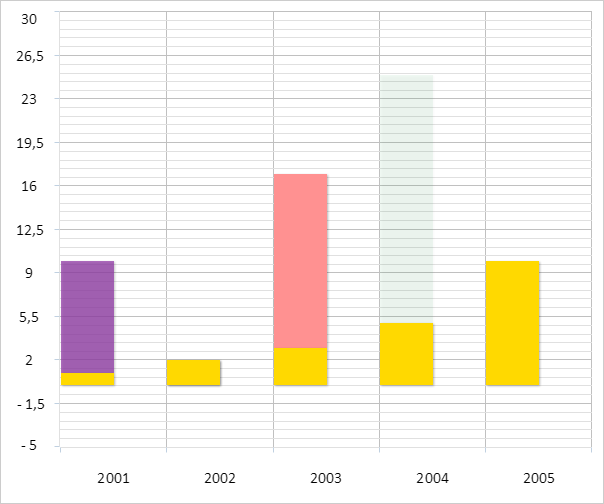

# ChartCanvasSerie.BorderPenEnabled

ChartCanvasSerie.BorderPenEnabled
-

# ChartCanvasSerie.BorderPenEnabled

## Синтаксис

BorderPenEnabled: Boolean;

## Описание

Свойство BorderPenEnabled определяет,
 отображается ли граница у элементов, соответствующих точкам ряда данных
 диаграммы.

## Комментарии

Значение свойства устанавливается из JSON и возвращается с помощью метода
 getBorderPenEnabled.

Допустимые значения:

	- true.
	 Граница у элементов, соответствующих точкам ряда данных диаграммы,
	 отображается (по умолчанию);

	- false.
	 Граница у элементов, соответствующих точкам ряда данных диаграммы,
	 не отображается.

## Пример

Для выполнения примера необходимо наличие на html-странице компонента
 [Chart](../../../Components/Chart/Chart.htm) с наименованием
 «chart» (см. «[Пример
 создания гистограммы с накоплением](../../../Components/Chart/ChartPoint.htm)»). Скроем границу у столбцов второго
 ряда гистограммы:

// Получаем второй ряд данных
var serie = chart.getSeries()[1];
if (serie) {
    PP.Object.defineProps(PP.Ui.ChartCanvasSerie, ["BorderPenEnabled"], true);
    // Запрещаем отображение границ у столбцов
    serie.setBorderPenEnabled(false);
    // Перерисовываем гистограмму
    chart.redraw(true);
};
В результате выполнения примера у столбцов второго ряда гистограммы
 была скрыта граница:

См. также:

[ChartCanvasSerie](ChartCanvasSerie.htm)

		Справочная
		 система на версию 10.9
		 от 18/08/2025,
		 © ООО «ФОРСАЙТ»,
