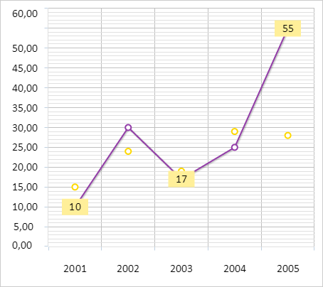

# ChartCanvasSerie.DataLabels

ChartCanvasSerie.DataLabels
-

# ChartCanvasSerie.DataLabels

## Синтаксис

DataLabels: Object;

## Описание

Свойство DataLabels определяет
 настройки подписей данных для точек ряда данных диаграммы.

## Комментарии

Значение свойства устанавливается из JSON и с помощью метода setDataLabels,
 а возвращается с помощью метода getDataLabels.

Объект с настройками может содержать следующие поля:

	- Color: "rgba(145, 143, 141, 1.000000)" // Цвет

	- Enabled: true // Признак отображения

	- Font: Object // Шрифт

	- Mask: "%Autovalue" // Текстовая маска

	- Position: "Center" // Положение

	- Rotation: 0 // Поворот

	- ValueFormat: "#,##0.00"  // Формат числа

## Пример

Для выполнения примера необходимо наличие на html-странице компонента
 [Chart](../../../Components/Chart/Chart.htm) с наименованием
 «chart» (см. «[Пример
 создания линейной диаграммы](../../../Components/Chart/ChartLine.htm)»). Отрисуем для точек первого ряда данных
 с индексами 0, 2, 4 подписи данных со значением данных точек:

// Получаем первый ряд данных
var serie = chart.getSerie(0);
for (var i in serie.getPoints()) {
    var point = serie.getPoints()[i];
    point.setDataLabels({
        Enabled: true
    });
    // Получаем настройки подписей данных
    var labelsOptions = serie.getDataLabels();
    labelsOptions.Text = point.getY();
    labelsOptions.Parent = serie;
    labelsOptions.Left = point.getPlotX();
    labelsOptions.Top = point.getPlotY();
    var dataLabel = new PP.Ui.ChartText(labelsOptions);
    point.setDataLabel(dataLabel);
};
// Отрисовываем подписи данных для точек ряда данных
serie.drawDataLabels([0, 2, 4], true);
В результате выполнения примера для точек первого ряда данных с индексами
 0, 2 и 4 были отрисованы подписи данных со значениями этих точек:

См. также:

[ChartCanvasSerie](ChartCanvasSerie.htm)

		Справочная
		 система на версию 10.9
		 от 18/08/2025,
		 © ООО «ФОРСАЙТ»,
