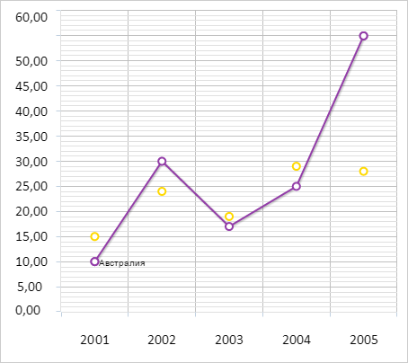

# ChartCanvasSerie.DrawContext

ChartCanvasSerie.DrawContext
-

# ChartCanvasSerie.DrawContext

## Синтаксис

DrawContext: CanvasRenderingContext2D;

## Описание

Свойство DrawContext определяет
 контекст рисования ряда данных диаграммы.

## Комментарии

Свойство предназначено для чтения.

## Пример

Для выполнения примера необходимо наличие на html-странице компонента
 [Chart](../../../Components/Chart/Chart.htm) с наименованием
 «chart» (см. «[Пример
 создания линейной диаграммы](../../../Components/Chart/ChartLine.htm)»). Отрисуем для первого ряда данных диаграммы
 наименование ряда:

// Получаем первый ряд данных
var serie = chart.getSerie(0);
// Получаем первую точку ряда
var point = serie.getPoint(0);
// Получаем контекст рисования ряда данных диаграммы
var context = serie.getDrawContext();
// Отрисовываем текст на канве
context.fillText(serie.getName(), point.getPlotX() + 5, point.getPlotY() + 5);
В результате выполнения примера для первого ряда данных диаграммы было
 отрисовано его наименование:

См. также:

[ChartCanvasAxis](../ChartCanvasAxis/ChartCanvasAxis.htm)

		Справочная
		 система на версию 10.9
		 от 18/08/2025,
		 © ООО «ФОРСАЙТ»,
