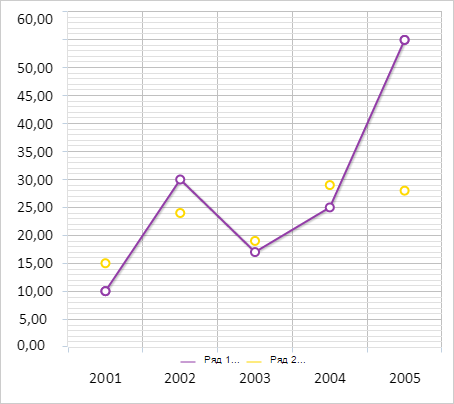

# ChartCanvasSerie.LegendText

ChartCanvasSerie.LegendText
-

# ChartCanvasSerie.LegendText

## Синтаксис

LegendText: String;

## Описание

Свойство LegendText определяет
 подпись элемента легенды.

## Комментарии

Значение свойства устанавливается из JSON и с помощью метода setLegendText,
 а возвращается с помощью метода getLegendText.

## Пример

Для выполнения примера необходимо наличие на html-странице компонента
 [Chart](../../../Components/Chart/Chart.htm) с наименованием
 «chart» (см. «[Пример
 создания линейной диаграммы](../../../Components/Chart/ChartLine.htm)»). Отрисуем легенду для линейной диаграммы,
 установив подписи для её элементов и допустимую длину текста:

// Рисует легенду диаграммы
function drawLegend() {
    var legend = chart.getLegend();
    var legendItems = [];
    for (var i in chart.getSeries()) {
        var serie = chart.getSeries()[i];
        // Определяем подпись элемента легенды
        var text = serie.getLegendText();
        if (text.length > serie.getLegendTextWidth()) {
            text = text.slice(0, serie.getLegendTextWidth());
            text += "...";
        }
        // Создаём элемент легенды
        var item = {
            BorderColor: serie.getColor(),
            Color: serie.getColor(),
            Marker: "Line",
            MarkerBorderColor: serie.getColor(),
            Text: text
        };
        // Добавляем элемент в легенду
        legendItems.push(item);
    };
    // Устанавливаем элементы легенды
    legend.setItems(legendItems);
    var plotBorders = chart.getPlotBorders();
    // Создаём область легенды
    var freeArea = new PP.Rect({
        Left: plotBorders.X,
        Top: plotBorders.Y + 50,
        Width: plotBorders.W,
        Height: plotBorders.H
    });
    // Отрисовываем легенду
    legend.draw(freeArea, "chart");
}

// Отображаем легенду
chart.getLegend().setIsVisible(true);
chart.redraw(false);

// Устанавливаем текст в легенде для рядов диаграммы
for (var i in chart.getSeries()) {
    var serie = chart.getSeries()[i];
    serie.setLegendText(serie.getCustomData() + ": " + serie.getName());
    serie.setLegendTextWidth(5);
}
// Отрисовываем легенду
drawLegend();
В результате выполнения примера была отображена легенда диаграммы. Установленные
 подписи её элементов были обрезаны до 5 букв:

См. также:

[ChartCanvasSerie](ChartCanvasSerie.htm)

		Справочная
		 система на версию 10.9
		 от 18/08/2025,
		 © ООО «ФОРСАЙТ»,
