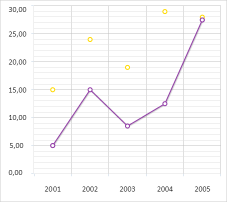

# ChartCanvasSerie.SecondaryAxis

ChartCanvasSerie.SecondaryAxis
-

# ChartCanvasSerie.SecondaryAxis

## Синтаксис

SecondaryAxis: Boolean;

## Описание

Свойство SecondaryAxis определяет
 признак использования дополнительной оси для ряда данных диаграммы.

## Комментарии

Значение свойства устанавливается из JSON и с помощью метода setSecondaryAxis,
 а возвращается с помощью метода getSecondaryAxis.

Допустимые значения:

	- true.
	 Для ряда данных диаграммы используется дополнительная ось;

	- false.
	 Для ряда данных диаграммы не используется дополнительная ось (по умолчанию).

## Пример

Для выполнения примера необходимо наличие на html-странице компонента
 [Chart](../../../Components/Chart/Chart.htm) с наименованием
 «chart» (см. «[Пример
 создания линейной диаграммы](../../../Components/Chart/ChartLine.htm)»). Привяжем к первому ряду данных диаграммы
 дополнительную ось:

// Получаем первый ряд данных
var serie = chart.getSeries()[0];
// Привязываем первый ряд данных к дополнительной оси
serie.setSecondaryAxis(true);
В результате выполнения примера к первому ряду данных диаграммы была
 привязана дополнительная ось. В соответствии с ней были пересчитаны координаты
 второго ряда данных:

См. также:

[ChartCanvasSerie](ChartCanvasSerie.htm)

		Справочная
		 система на версию 10.9
		 от 18/08/2025,
		 © ООО «ФОРСАЙТ»,
