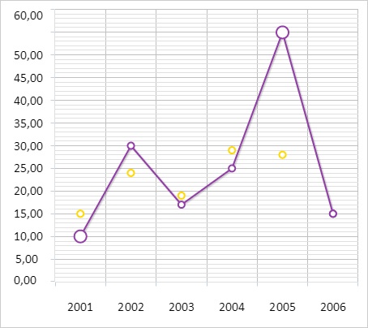

# ChartCanvasSerie.addPoint

ChartCanvasSerie.addPoint
-

# ChartCanvasSerie.addPoint

## Синтаксис

addPoint(options: Object, redraw: Boolean);

## Параметры

options. JSON-объект с настройками
 ряда данных диаграммы;

redraw. Признак перерисовки
 диаграммы. Допустимые значения:

	- true.
	 Диаграмма будет перерисована;

	- false.
	 Диаграмма не будет перерисована (по умолчанию).

## Описание

Метод addPoint добавляет точку
 в ряд данных диаграммы.

## Пример

Для выполнения примера необходимо наличие на html-странице компонента
 [Chart](../../../Components/Chart/Chart.htm) с наименованием
 «chart» (см. «[Пример
 создания линейной диаграммы](../../../Components/Chart/ChartLine.htm)»). Добавим фиктивную точку в первый ряд
 данных диаграммы:

function defineEvents(serie) {
    // Обрабатываем событие PointAdd
    serie.PointAdd.add(function(sender, args) {
        console.log("Добавлена точка со значением %s", args);
        setMarkersRadius(serie, 15);
        sender.redrawConnectors()
    });
    // Обрабатываем событие RemovePoint
    serie.RemovePoint.add(function(sender, args) {
        console.log("Удалена точка со значением %s", args);
    });
};
// Устанавливает размер маркеров для ряда данных
function setMarkersRadius(serie, radius) {
    // Получаем настройки ряда данных диаграммы
    var states = serie.getStates();
    states.Normal.Marker.Radius = radius;
}
// Создаёт точку ряда данных
function createPoint(serie) {
    // Создаём новую точку ряда
    var point = {
        Color: "#ff0000",
        Id: "customPoint",
        Name: "custom",
        Parent: serie,
        X: serie.getPoints().length,
        Y: 15,
    };
    // Добавляем данную точку
    serie.addPoint(point, true);
    serie.PointAdd.fire(serie, point.Y);
};
// Удаляем точку ряда данных
function removePoint(index) {
    var points1 = serie.getPoints().length;
    // Получаем точку ряда
    var removePoint = serie.getPoint(index);
    // Удаляем точку ряда
    serie.removePoint(serie.getPoints().length - 1, true);
    var points2 = serie.getPoints().length;
    if (points2 < points1) {
        serie.RemovePoint.fire(serie, removePoint.getY());
    }
};
// Получаем первый ряд данных
var serie = chart.getSeries()[0];
// Определяем событие
defineEvents(serie);
// Создаём точку
createPoint(serie);
В результате выполнения примера в первый ряд данных диаграммы была добавлена
 точка:

В консоли браузера было выведено соответствующее сообщение:

Добавлена точка со значением 15

Удалим теперь данную точку ряда:

removePoint(serie.getPoints().length - 1);
После выполнения примера была удалена последняя точка первого ряда данных
 диаграммы. Соответствующее сообщение было выведено в консоли браузера:

Удалена точка со значением 15

См. также:

[ChartCanvasSerie](ChartCanvasSerie.htm)

		Справочная
		 система на версию 10.9
		 от 18/08/2025,
		 © ООО «ФОРСАЙТ»,
