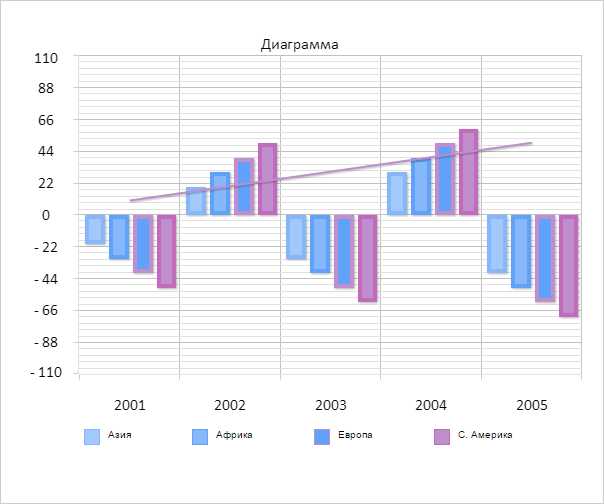

# ChartCanvasSerie.getPointByPosition

ChartCanvasSerie.getPointByPosition
-

# ChartCanvasSerie.getPointByPosition

## Синтаксис

getPointByPosition(index: Number);

## Параметры

index. Позиция элемента на
 оси X;

## Описание

Метод getPointByPosition возвращает
 элемент ряда данных диаграммы по его позиции на оси X.

## Комментарии

Метод возвращает значение типа [PP.Ui.ChartPoint](../ChartPoint/ChartPoint.htm).

Если элемента на заданной позиции не существует, то метод возвращает
 значение null.

## Пример

Для выполнения примера необходимо наличие на html-странице компонента
 [Chart](../../../Components/Chart/Chart.htm)
 с наименованием «chart» (см. «[Пример
 создания гистограммы](../../../Components/Chart/Chart_Example.htm)»). Получим элемент ряда данных диаграммы по его
 позиции, выведем его значение и скроем ряд данных:

var serieNumber = 0;
// Получаем ряд данных
var serie = chart.getSeries()[serieNumber];
// Получаем данные ряда по оси X
var xData = serie.getXData();
// Получаем позицию элемента на оси X
var xPosition = xData[xData.length - 1];
// Получаем элемент ряда данных по позиции на оси X
var point = serie.getPointByPosition(xPosition);
// Получаем данные ряда по оси Y
var yData = serie.getYData();
// Выводим значение для полученного элемента ряда данных
var pointNumber = point.getIndex();
console.log("Ряд: " + serieNumber + " элемент: " + pointNumber + " значение: " + yData[pointNumber]);
// Скрываем ряд данных
serie.setIsVisible(false, true);
В результате выполнения примера один из рядов данных диаграммы был скрыт:

В консоли браузера было выведено было выведено значение одного из элементов
 ряда диаграммы:

Ряд: 0 элемент: 4 значение: -30

См. также:

[ChartCanvasSerie](ChartCanvasSerie.htm)

		Справочная
		 система на версию 10.9
		 от 18/08/2025,
		 © ООО «ФОРСАЙТ»,
