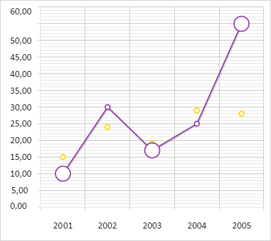

# ChartCanvasSerie.redrawHoverPoint

ChartCanvasSerie.redrawHoverPoint
-

# ChartCanvasSerie.redrawHoverPoint

## Синтаксис

redrawHoverPoint(indexes: Array, state: String);

## Параметры

indexes. Массив индексов точек
 у ряда данных диаграммы;

state. Признак того, наведён
 ли указатель мыши на точку ряда данных диаграммы. Допустимые значения:

	- Hover.
	 На ряд данных диаграммы наведён указатель мыши;

	- Unhover.
	 На ряд данных диаграммы не наведён указатель мыши (по умолчанию);

## Описание

Метод redrawHoverPoint перерисовывает
 точки ряда данных диаграммы.

## Пример

Для выполнения примера необходимо наличие на html-странице компонента
 [Chart](../../../Components/Chart/Chart.htm) с наименованием
 «chart» (см. «[Пример
 создания линейной диаграммы](../../../Components/Chart/ChartLine.htm)»). Увеличим размеры маркеров у точек ряда
 данных с индексами 0, 2 и 4:

// Устанавливает размер маркеров для ряда данных
function setMarkersRadius(serie, radius) {
        // Получаем настройки ряда данных диаграммы
        var states = serie.getStates();
        states.Normal.Marker.Radius = radius;
    }
    // Получаем первый ряд данных
var serie = chart.getSeries()[0];
// Устанавливаем новый радиус маркеров для точек с индексами 0, 2 и 4
setMarkersRadius(serie, 25);
// Перерисовываем точки ряда данных
serie.redrawHoverPoint([0, 2, 4], "Hover");
В результате выполнения примера для точек ряда данных диаграммы
 с индексами 0, 2 и 4 был установлен размер маркеров, равный 25 пикселям:

См. также:

[ChartCanvasSerie](ChartCanvasSerie.htm)

		Справочная
		 система на версию 10.9
		 от 18/08/2025,
		 © ООО «ФОРСАЙТ»,
