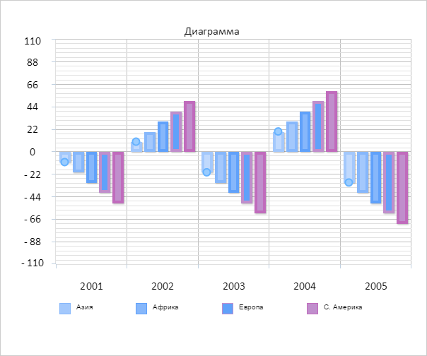

# ChartEditMode.activateSerie

ChartEditMode.activateSerie
-

# ChartEditMode.activateSerie

## Синтаксис

activateSerie(serie: PP.Ui.[ChartCanvasSerie](../ChartCanvasSerie/ChartCanvasSerie.htm));

## Параметры

serie. Серия точек.

## Описание

Метод activateSerie активирует
 серию для редактирования.

## Пример

Для выполнения примера необходимо наличие на html-странице компонента
 [Chart](../../../Components/Chart/Chart.htm) с наименованием
 «chart» (см. «[Пример
 создания компонента Chart](../../../Components/Chart/Chart_Example.htm)»). Создадим новый режим редактирования и
 добавим его к диаграмме:

// Создаем режим редактирования
editMode = new PP.Ui.ChartEditMode({
    Parent: chart,
    // Устанавливаем режим редактирования
    Mode: "Point"
});
// Добавляем режим редактирования к диаграмме
chart.getEditMode().setSettings(editMode.getSettings());
// Получаем режим редактирования
var chartEditMode = chart.getEditMode();
Добавим к режиму редактирования обработчики событий начала и окончания
 изменения серии. Добавим к документу обработчики событий движения и нажатия
 мыши. Активируем режим редактирования и выберем для редактирования первую
 серию точек:

// Добавляем обработчики событий редактирования диаграммы
chartEditMode.EditStarted.add(function(sender, args) {
    console.log("Началось редактирование диаграммы");
});
chartEditMode.Edited.add(function(sender, args) {
    console.log("Закончилось редактирование диаграммы");
});
// Добавляем обработчик события нажатия кнопки мыши по странице
document.onmousedown = function(sender, args) {
    var mc = PP.calculateMouseCoords(sender);
    var offset = PP.calculateOffset(chart.getDomNode());
    chartEditMode.handleMouseDown({
        X: mc.X - offset.X,
        Y: mc.Y - offset.Y
    }, sender);
    if (chartEditMode.getCursorOnMarker()) {
        console.log("Курсор над маркером");
    }
}
// Добавляем обработчик события движения мыши по странице
document.onmousemove = function(sender, args) {
    var mc = PP.calculateMouseCoords(sender);
    var offset = PP.calculateOffset(chart.getDomNode());
    chartEditMode.handleMouseMove({
        X: mc.X - offset.X,
        Y: mc.Y - offset.Y
    }, sender);
}
// Добавляем обработчик события отпускания кнопки мыши
document.onmouseup = function(sender, args) {
    chartEditMode.handleMouseUp({
        X: sender.x,
        Y: sender.y
    }, sender);
}
// Активируем режим редактирования
chartEditMode.setEnabled(true);
// Активируем первую серию для редактирования
chartEditMode.activateSerie(chart.getSeries()[0]);
В результате диаграмма стала доступной для редактирования:

Растянем первую точку серии вниз. В результате в консоль были выведены
 следующие сообщения:

Началось редактирование диаграммы

Курсор над маркером

Закончилось редактирование диаграммы

См. также:

[ChartEditMode](ChartEditMode.htm)

		Справочная
		 система на версию 10.9
		 от 18/08/2025,
		 © ООО «ФОРСАЙТ»,
