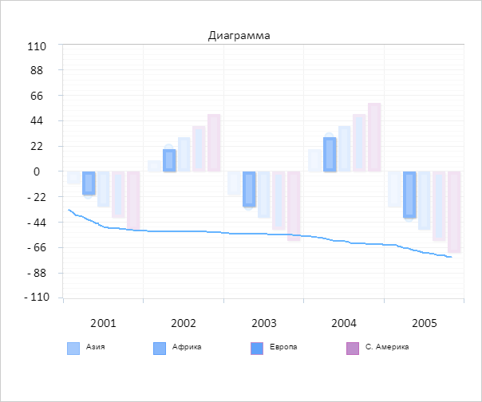
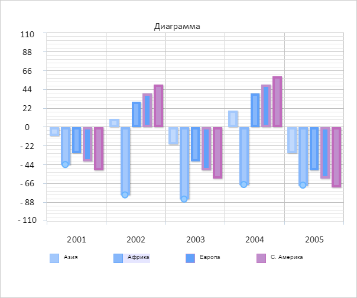

# ChartEditMode.redraw

ChartEditMode.redraw
-

# ChartEditMode.redraw

## Синтаксис

redraw();

## Описание

Метод redraw перерисовывает
 диаграмму в режиме редактирования.

## Пример

Для выполнения примера необходимо наличие на html-странице компонента
 [Chart](../../../Components/Chart/Chart.htm) с наименованием
 «chart» (см. «[Пример
 создания компонента Chart](../../../Components/Chart/Chart_Example.htm)»). Проверим, не изменяется какой-либо элемент
 диаграммы в режиме редактирования. Устанавливаем способ редактирования
 диаграммы и активируем режим редактирования:

// Получаем режим редактирования
var chartEditMode = chart.getEditMode();
// Проверяем изменение элементов
if (chartEditMode.getIsEditing()) {
    console.log("Изменяется элемент диаграммы");
} else {
    console.log("Ни один элемент диаграммы не изменяется");
}
// Устанавливаем способ редактирования диаграммы
chartEditMode.setMode("Pencil");
// Активируем режим редактирования
chartEditMode.setEnabled(true);
В результате в консоль был выведен результат проверки редактирования
 элемента диаграммы:

Ни один элемент диаграммы не изменяется

Выберем вторую серию и изменим значение столбцов:

Перерисуем диаграмму в режиме редактирования:

// Перерисовываем диаграмму в режиме редактирования
chartEditMode.redraw();
В результате значения столбцов были изменены:

См. также:

[ChartEditMode](ChartEditMode.htm)

		Справочная
		 система на версию 10.9
		 от 18/08/2025,
		 © ООО «ФОРСАЙТ»,
