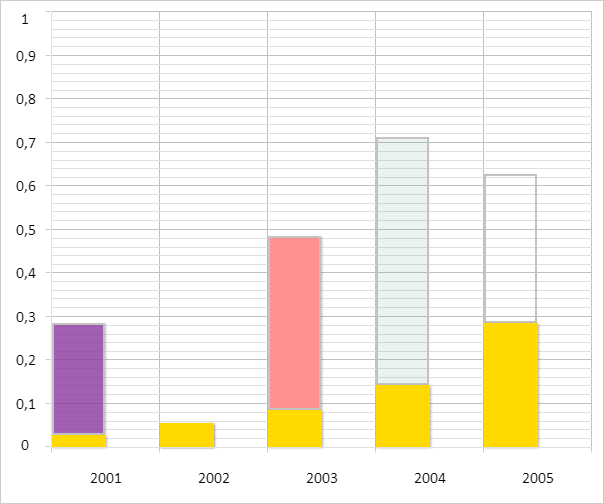

# ChartPoint.Percentage

ChartPoint.Percentage
-

# ChartPoint.Percentage

## Синтаксис

Percentage: Number;

## Описание

Свойство Percentage определяет
 отношение значения точки ряда данных диаграммы по оси Y к высоте данной
 оси.

## Комментарии

Значение свойства устанавливается из JSON и с помощью метода setPercentage,
 а возвращается с помощью метода getPercentage.

## Пример

Для выполнения примера необходимо наличие на html-странице компонента
 [Chart](../../../Components/Chart/Chart.htm)
 с наименованием «chart» (см. «[Пример
 создания гистограммы с накоплением](../../../Components/Chart/ChartPoint.htm)»). Свяжем первую точку второго
 ряда данных диаграммы с остальными точками данного ряда и изменим её состояние:

// Устанавливает режим отображения данных диаграммы в процентах
function setPercentage() {
        // Получаем ось Y диаграммы
        var axis = chart.getYAxis();
        var axisHeight = Math.abs(axis.getMin()) + axis.getMax();
        // Устанавливаем минимальное и максимальное значения оси
        axis.setMin(0);
        axis.setMax(1);
        for (var i in chart.getSeries()) {
            var serie = chart.getSeries()[i];
            for (var j in serie.getPoints()) {
                var point = serie.getPoints()[j];
                point.setPercentage(point.getY() / axisHeight);
                point.setPercentPart(point.getYBottom() / axisHeight);
            }
        }
    }
    // Устанавливаем режим отображения данных диаграммы в процентах
setPercentage();
// Обновляем столбцы диаграммы после их отрисовки
refreshAfterRender();
В результате выполнения примера был установлен режим отображения данных
 диаграммы в процентах:

См. также:

[ChartPoint](ChartPoint.htm)

		Справочная
		 система на версию 10.9
		 от 18/08/2025,
		 © ООО «ФОРСАЙТ»,
