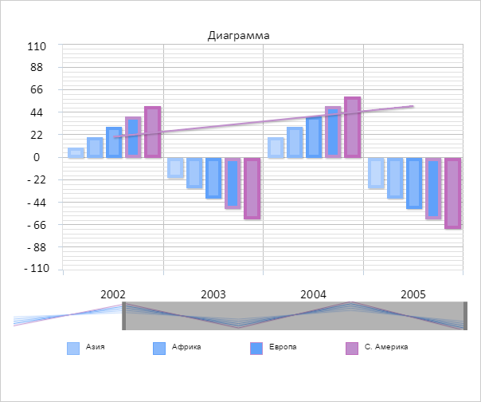
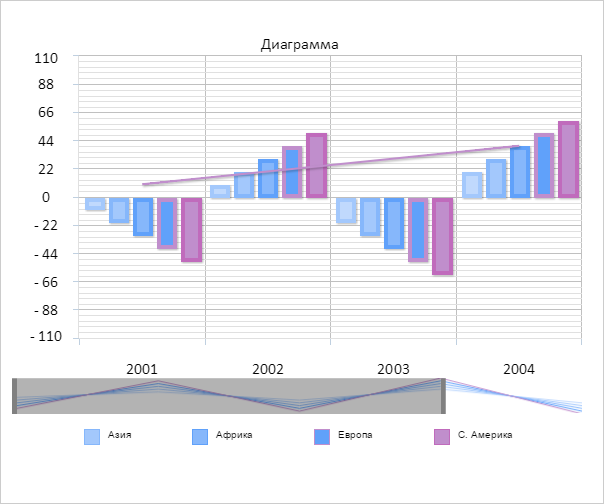

# ChartScroller.Resized

ChartScroller.Resized
-

# ChartScroller.Resized

## Синтаксис

Resized: function(sender, args);

## Параметры

sender. Источник события;

args. Информация
 о событии. Аргументы: Points
 - количество отображаемых элементов оси X.

## Описание

Событие Resized наступает после
 изменения ширины элемента прокрутки.

## Пример

Для выполнения примера необходимо наличие экземпляра класса [ChartScroller](ChartScroller.htm)
 с наименованием «scroller» (см. «[Конструктор
 ChartScroller](Constructor_ChartScroller.htm)»). Добавим обработчик события изменения ширины элемента
 прокрутки:

// Добавляем обработчик события изменения ширины
scroller.Resized.add(function(sender, args) {
    console.log("Изменилась ширина элемента прокрутки");
});
Изменим ширину элемента прокрутки:

Добавим обработчик нажатия кнопки мыши в документе:

// Добавляем обработчик нажатия кнопки мыши
document.onclick = function(sender, args) {
    scroller.handleClick({ X: sender.x, Y: sender.y });
}
Нажмем кнопкой мыши левее элемента прокрутки. В результат элемент прокрутки
 сдвинется влево:

См. также:

[ChartScroller](ChartScroller.htm)

		Справочная
		 система на версию 10.9
		 от 18/08/2025,
		 © ООО «ФОРСАЙТ»,
