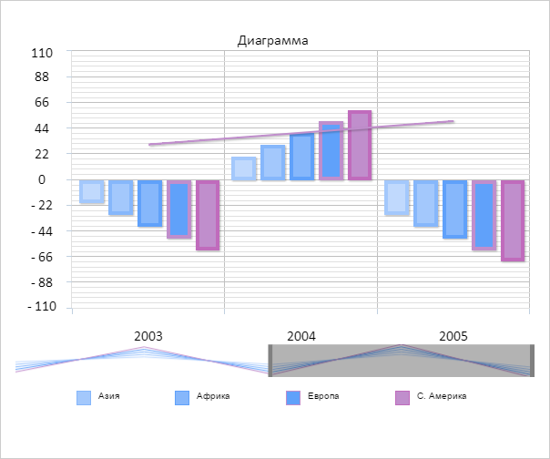

# ChartScroller.handleMouseDown

ChartScroller.handleMouseDown
-

# ChartScroller.handleMouseDown

## Синтаксис

handleMouseDown(coords: Object, event: Object);

## Параметры

coords. Объект с координатами.
 Объект должен содержать поля: X
 - координата по оси X, Y - координата
 по оси Y;

event. Объект события.

## Описание

Метод handleMouseDown обрабатывает
 событие нажатия курсора по элементу прокрутки.

## Пример

Для выполнения примера необходимо наличие экземпляра класса [ChartScroller](ChartScroller.htm)
 с наименованием «scroller» (см. «[Конструктор
 ChartScroller](Constructor_ChartScroller.htm)»). Добавим обработчики следующих событий к элементу
 прокрутки: [Scrolled](ChartScroller.Scrolled.htm), [ScrollMove](ChartScroller.ScrollMove.htm),
 [ScrollStart](ChartScroller.ScrollStart.htm). Добавим обработчик
 события [Scroll](../Chart/Chart.Scroll.htm) к диаграмме. Добавим
 к документу обработчики событий нажатия и движения мыши:

// Добавляем обработчики событий движения элемента прокрутки
scroller.ScrollStart.add(function(sender, args) {
    console.log("Началось движения элемента прокрутки");
});
scroller.ScrollMove.add(function(sender, args) {
    console.log("Происходит движение элемента прокрутки");
});
scroller.Scrolled.add(function(sender, args) {
    console.log("Движение элемента прокрутки закончилось");
});
// Добавляем обработчик события прокрутки к диаграмме
chart.Scroll.add(function(sender, args) {
    console.log("Прокрутка выполнена");
});
// Добавляем обработчик события нажатия кнопки мыши по странице
document.onmousedown = function(sender, args) {
        scroller.handleMouseDown({
            X: sender.x,
            Y: sender.y
        });
    }
    // Добавляем обработчик события движения мыши по странице
document.onmousemove = function(sender, args) {
        scroller.handleMouseMove({
            X: sender.x,
            Y: sender.y
        });
    }
    // Добавляем обработчик события отпускания кнопки мыши
document.onmouseup = function(sender, args) {
    scroller.handleMouseUp({
        X: sender.x,
        Y: sender.y
    });
}
После захвата элемента прокрутки в консоль будет выведено следующее
 сообщение:

Началось движения элемента прокрутки

После изменения положения элемента прокрутки в консоль будет выведено
 следующее сообщение:

Происходит движение элемента прокрутки

После отпускания кнопки мыши в консоль будет выведено следующие сообщения:

Движение элемента прокрутки закончилось

Прокрутка выполнена

Изменятся элементы отображения на диаграмме:

См. также:

[ChartScroller](ChartScroller.htm)

		Справочная
		 система на версию 10.9
		 от 18/08/2025,
		 © ООО «ФОРСАЙТ»,
