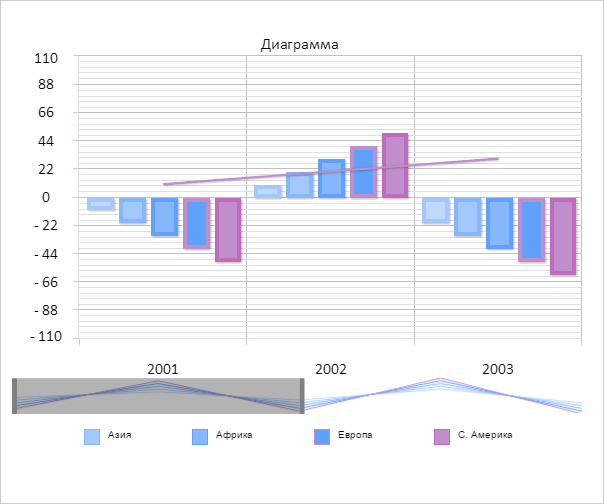
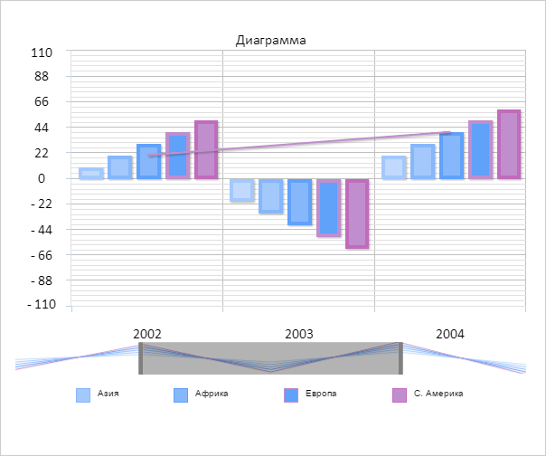

# Конструктор ChartScroller

Конструктор ChartScroller
-

# Конструктор ChartScroller

## Синтаксис

PP.Ui.ChartScroller(settings);

## Параметры

settings. JSON-объект со значениями
 свойств компонента.

## Описание

Конструктор ChartScroller создает
 экземпляр класса ChartScroller.

## Пример

Для выполнения примера необходимо наличие на html-странице компонента
 [Chart](../../../Components/Chart/Chart.htm) с наименованием
 «chart» (см. «[Пример
 создания компонента Chart](../../../Components/Chart/Chart_Example.htm)»). Создадим элемент прокрутки и добавим
 его на диаграмму:

// Устанавливаем элемент прокрутки диаграмме
var scroller1 = new PP.Ui.ChartScroller({
    // Устанавливаем родительскую диаграмму
    Parent: chart,
    // Включаем элемент прокрутки
    Enabled: true,
    // Устанавливаем максимальное количество отображаемых элементов оси X
    MaxPointsInSight: 2
});
// Получаем элемент прокрутки
var scroller = chart.getScroller();
// Устанавливаем новые настройки элементу прокрутки
scroller.setSettings(scroller1.getSettings());
Проверим, добавлен ли элемент прокрутки на диаграмму и перерисуем его:

// Проверяем, добавлен ли элемент прокрутки на диаграмму
if (scroller.getIsActual()) {
    console.log("Элемент прокрутки добавлен на диаграмму");
} else {
    console.log("Элемент прокрутки не добавлен на диаграмму");
}
// Перерисовываем элемент прокрутки
scroller.redraw();
К диаграмме был добавлен элемент прокрутки:

В результате в консоль было выведено сообщение о добавлении элемента
 прокрутки:

Элемент прокрутки добавлен на диаграмму

Сдвинем элемент прокрутки вправо на один шаг:

// Получаем количество интервалов между делениями оси X
console.log("Количество интервалов между делениями оси X: " + scroller.getRealXLength());
// Сдвигаем элемент прокрутки вправо на один шаг
scroller.setPosition(scroller.getPosition()+1);
В консоль было выведено количество элементов оси X:

Количество интервалов между делениями оси X: 4

В результате элемент прокрутки будет сдвинут вправо на один шаг:

См. также:

[ChartScroller](ChartScroller.htm)

		Справочная
		 система на версию 10.9
		 от 18/08/2025,
		 © ООО «ФОРСАЙТ»,
