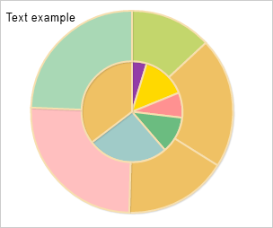
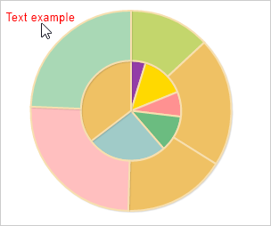
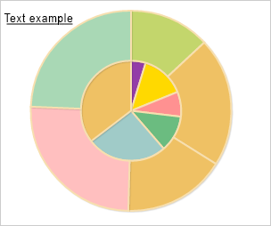

# Конструктор ChartText

Конструктор ChartText
-

# Конструктор ChartText

## Синтаксис

PP.Ui.ChartText(settings);

## Параметры

settings. JSON-объект со значениями
 свойств класса.

## Описание

Конструктор ChartText создает
 экземпляр класса ChartText.

## Пример

Для выполнения примера необходимо наличие на html-странице компонента
 [Chart](../Chart/Chart.htm) с наименованием «chart» (см. «[Пример создания круговой
 диаграммы](../../../Components/Chart/ChartPie.htm)»). Добавим текстовую метку на диаграмму. При наведении курсором
 мыши будем окрашивать её в красный цвет, при снятии наведения - в чёрный.
 При нажатии на метку будем её подчёркивать:

// Опредяет, расположена ли указанная точка в заданной области
function isPointInArea(area, point) {
    var isGreaterThanLeftBorder = (point.getX() >= area.getLeft()) ? true : false;
    var isLessThanRightBorder = (point.getX() <= area.getLeft() + area.getWidth()) ? true : false;
    var isGreaterThanToptBorder = (point.getY() >= area.getTop()) ? true : false;
    var isLessThanBottomBorder = (point.getY() <= area.getTop() + area.getHeight()) ? true : false;
    if (isGreaterThanLeftBorder & isLessThanRightBorder & isGreaterThanToptBorder & isLessThanBottomBorder) {
        return true;
    } else {
        return false;
    }
}
// Создаёт область построения диаграммы
function createPlotArea() {
    // Создаём область построения диаграммы
    var plotArea = new PP.Ui.ChartPlotArea({
        Parent: chart
    });
    return plotArea;
}
var label;
// Создаёт текстовую метку на диаграмме
function createChartText(plotArea) {
    // Получаем контекст области построения диаграммы
    var context = plotArea.getContext();
    label = new PP.Ui.ChartText({
        Font: new PP.Font(),
        Left: 15,
        Top: 15,
        Text: "Text example",
        Parent: chart.getSerie(0),
        Click: function(sender, args) {
            // Перерисовываем область построения диаграммы
            plotArea.redraw();
            label.getFont().setIsUnderline(!label.getFont().getIsUnderline());
            label.drawSelf(context);
        },
        MouseOut: function(sender, args) {
            // Перерисовываем область построения диаграммы
            plotArea.redraw();
            label.setColor("#000000");
            label.drawSelf(context);
        },
        MouseOver: function(sender, args) {
            // Перерисовываем область построения диаграммы
            plotArea.redraw();
            label.setColor("#FF0000");
            label.drawSelf(context);
        }
    });
    // Возвращаем размер текстовой метки
    label.getSize = function() {
        var size = new PP.Rect({
            Left: this.getLeft(),
            Top: this.getTop(),
            Width: this.getWidth(),
            Height: this.getHeight()
        });
        return size;
    }
    PP.Object.defineProps(PP.Ui.ChartText, ["Color", "Font"], true);
    // Отрисовываем метку
    label.drawSelf(context);
    return label;
}
// Добавлят обработчики событий диаграммы
function defineEventsForChart() {
    chart.setCustomData({
        IsMouseInLabelArea: false
    });
    chart.addEvent(chart.getDomNode(), "mousemove", onMouseMove);
    chart.addEvent(chart.getDomNode(), "click", onClicked);
}
// Обрабатывает событие MouseMove
function onMouseMove(sender, args) {
    var coord = new PP.Point({
        X: args.Event.x,
        Y: args.Event.y
    });
    if (isPointInArea(label.getSize(), coord)) {
        label.MouseOver.fire(this, args);
        chart.getCustomData().IsMouseInLabelArea = true;
    } else {
        if (chart.getCustomData().IsMouseInLabelArea) {
            label.MouseOut.fire(this, args);
            chart.getCustomData().IsMouseInLabelArea = false;
        }
    }
};
// Обрабатывает событие Click
function onClicked(sender, args) {
    var coord = new PP.Point({
        X: args.Event.x,
        Y: args.Event.y
    });
    if (isPointInArea(label.getSize(), coord)) {
        label.Click.fire(this, args);
    }
};
// Создаём область построения диаграммы
var plotArea = createPlotArea();
// Создаём текстовую метку на диаграмме
createChartText(plotArea);
// Добавляем обработчики событий диаграммы
defineEventsForChart();
В результате выполнения примера на диаграмму была добавлена текстовая
 метка «Text example»:

При наведении курсором мыши текстовая метка окрашивается в красный цвет:

При нажатии текстовая метка подчёркивается:

См. также:

[ChartText](ChartText.htm)

		Справочная
		 система на версию 10.9
		 от 18/08/2025,
		 © ООО «ФОРСАЙТ»,
