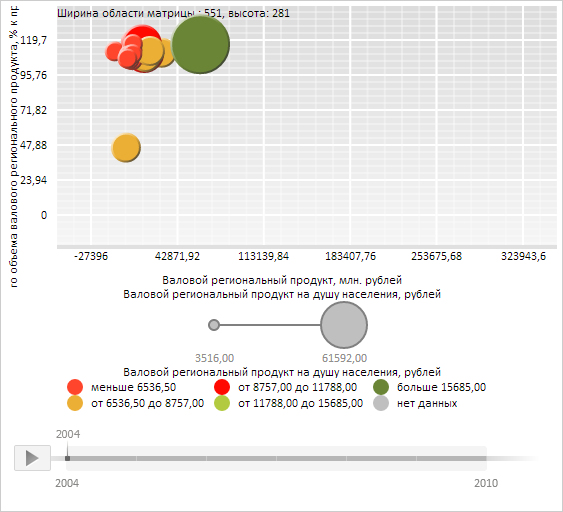

# ChartLabel.MaskText

ChartLabel.MaskText
-

**

# ChartLabel.MaskText

## Синтаксис

MaskText: String

## Описание

Свойство MaskText** определяет
 маску текста метки.

## Комментарии

Значение свойства устанавливается из JSON и с помощью метода setMaskText,
 а возвращается с помощью метода getMaskText.

## Пример

Для выполнения примера необходимо наличие на html-странице компонента
 [BubbleChart](dhtmlBubbleChart.chm::/Components/BubbleChart/BubbleChart.htm)
 с наименованием «bubbleChart» (см. «[Пример
 создания компонента BubbleChart](dhtmlBubbleChart.chm::/Components/BubbleChart/BubbleChart_Example.htm)»). Создадим текстовую метку с маской,
 позволяющей отобразить информацию о размерах области пузырьковой диаграммы:

// Получим область пузырьковой диаграммы
var chartArea = bubbleChart.getChartArea();
// Создадим новую метку
var label = new PP.Ui.ChartLabel({
    MaskText: "Ширина области пузырьковой диаграммы : {%Width:#,#}, высота: {%Height:#,#}",
});
// Отрисуем метку
label.draw(false, chartArea._GridLayer, {
    Width: chartArea.getWidth(),
    Height: chartArea.getHeight()
});

В результате выполнения примера в пузырьковой диаграмме была отрисована текстовая
 метка с использованием маски «Ширина области пузырьковой диаграммы : {%Width:#,#}, высота:
 {%Height:#,#}»:

См. также:

[ChartLabel](ChartLabel.htm)

		Справочная
		 система на версию 10.9
		 от 18/08/2025,
		 © ООО «ФОРСАЙТ»,
