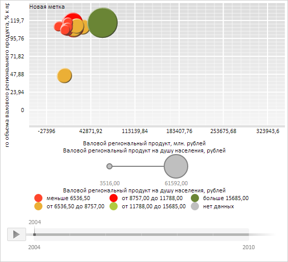

# Конструктор ChartLabel

Конструктор ChartLabel
-

# Конструктор ChartLabel

## Синтаксис

PP.Ui.ChartLabel(settings: Object);

## Параметры

settings. JSON-объект
 со значениями свойств компонента.

## Описание

Конструктор ChartLabel создает
 экземпляр класса [ChartLabel](ChartLabel.htm).

## Пример

Для выполнения примера необходимо наличие на html-странице компонента
 [BubbleChart](dhtmlBubbleChart.chm::/Components/BubbleChart/BubbleChart.htm)
 с наименованием «bubbleChart» (см. «[Пример
 создания компонента BubbleChart](dhtmlBubbleChart.chm::/Components/BubbleChart/BubbleChart_Example.htm)»). Создадим для пузырьковой диаграммы новую текстовую
 метку и отрисуем её:

// Получим область графика
var chartArea = bubbleChart.getChartArea();
// Создадим новую метку
var label = new PP.Ui.ChartLabel({
    Alignment: PP.VerticalAlignment.Top,
    Direction: PP.Ui.TextDirection.LeftToRight,
    NoDataText: "No data",
    ShowHandCursor: true,
    TextWrapping: PP.Ui.TextWrapping.NoWrap,
    Text: "Новая метка"
});
// Отрисуем метку
label.draw(false, chartArea.getHistoryLayer());

В результате выполнения примера была отрисована текстовая метка:

См. также:

[ChartLabel](ChartLabel.htm)

		Справочная
		 система на версию 10.9
		 от 18/08/2025,
		 © ООО «ФОРСАЙТ»,
