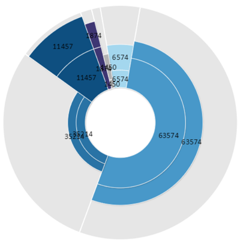

# EaxRadiusAngleChartView

EaxRadiusAngleChartView
-

**

# EaxRadiusAngleChartView

Пространство имен**: PP.Exp.Ui;

## Иерархия наследования

[Object](dhtmlCommon.chm::/Classes/object/object.htm)

[Control](dhtmlUi.chm::/Classes/control/control.htm)

[SourceView](dhtmlUi.chm::/Classes/SourceView/SourceView.htm)

[EaxChartView](dhtmlExpress.chm::/Classes/Express/EaxChartView/EaxChartView.htm)

EaxRadiusAngleChartView

## Описание

Класс EaxRadiusAngleChartView
 реализует круговую диаграмму с изменяемым радиусом сектора.

## Комментарии

Диаграмма с изменяемым радиусом сектора [подключается в
 качестве плагина](UiAdhoc.chm::/Blocks/Plugins/Plugins.htm#web) и имеет две доступные метрики:

	- угол сектора;

	- радиус сектора.

[Пример использования диаграммы
 с изменяемым радиусом](EaxRadiusAngleChartView_Example.htm).

Диаграмма может принимать следующий вид:

## Синтаксис

PP.initClass(PP.Exp.Ui.EaxRadiusAngleChartView,
 [EaxChartView](dhtmlExpress.chm::/Classes/Express/EaxChartView/EaxChartView.htm),
 "PP.Exp.Ui.EaxRadiusAngleChartView");

## Конструктор

			 Имя конструктора
			 Краткое описание

			 
			 EaxRadiusAngleChartView
			 Конструктор предназначен для внутреннего использования.

## Свойства

		 Имя свойства
		 Краткое описание

		 
		 [Props](EaxRadiusAngleChartView.Props.htm)
		 Свойство Props определяет
		 параметры углового показателя.

## Свойства, унаследованные от класса [EaxChartView](dhtmlExpress.chm::/Classes/Express/EaxChartView/EaxChartView.htm)

		 Имя свойства
		 Краткое описание

		 
		 [ChartType](dhtmlExpress.chm::/Classes/Express/EaxChartView/EaxChartView.ChartType.htm)
		 Свойство ChartType
		 устанавливает и возвращает тип диаграммы экспресс-отчета.

		 
		 [EditMode](dhtmlExpress.chm::/Classes/Express/EaxChartView/EaxChartView.EditMode.htm)
		 Свойство EditMode
		 устанавливает режим редактирования диаграммы эспресс-отчета.

		 
		 [Instance](dhtmlExpress.chm::/Classes/Express/EaxChartView/EaxChartView.Instance.htm)
		 Свойство Instance
		 содержит экземпляр диаграммы экспресс-отчета.

		 
		 [LegendPosition](dhtmlExpress.chm::/Classes/Express/EaxChartView/EaxChartView.LegendPosition.htm)
		 Свойство LegendPosition
		 определяет расположение легенды диаграммы.

		 
		 [LoadConfirmThreshold](dhtmlExpress.chm::/Classes/Express/EaxChartView/EaxChartView.LoadConfirmThreshold.htm)
		 Свойство LoadConfirmThreshold
		 устанавливает максимальное число точек диаграммы экспресс-отчета.

		 
		 [MarkersEnabled](dhtmlExpress.chm::/Classes/Express/EaxChartView/EaxChartView.MarkersEnabled.htm)
		 Свойство MarkersEnabled
		 определяет признак отображения маркеров у рядов данных диаграммы.

		 
		 [MarkersSymbol](dhtmlExpress.chm::/Classes/Express/EaxChartView/EaxChartView.MarkersSymbol.htm)
		 Свойство MarkersSymbol
		 определяет форму маркера для рядов данных диаграммы.

		 
		 [Options](dhtmlExpress.chm::/Classes/Express/EaxChartView/EaxChartView.Options.htm)
		 Свойство Options
		 содержит настройки диаграммы экспресс-отчета.

		 
		 [Overflow](dhtmlExpress.chm::/Classes/Express/EaxChartView/EaxChartView.Overflow.htm)
		 Свойство Overflow определяет,
		 будет ли отображаться многоточие для невмещающегося элемента легенды.

		 
		 [ScrollerEnabled](dhtmlExpress.chm::/Classes/Express/EaxChartView/EaxChartView.ScrollerEnabled.htm)
		 Свойство ScrollerEnabled
		 определяет наличие элемента прокрутки у диаграммы экспресс-отчета.

		 
		 [ScrollerMaxPointsInSight](dhtmlExpress.chm::/Classes/Express/EaxChartView/EaxChartView.ScrollerMaxPointsInSight.htm)
		 Свойство ScrollerMaxPointsInSight
		 определяет максимальное количество шагов временной шкалы, для
		 которых будут отображены данные на диаграмме.

		 
		 [ScrollerPosition](dhtmlExpress.chm::/Classes/Express/EaxChartView/EaxChartView.ScrollerPosition.htm)
		 Свойство ScrollerPosition
		 определяет позицию элемента прокрутки в диаграмме.

		 
		 [SelectionEnabled](dhtmlExpress.chm::/Classes/Express/EaxChartView/EaxChartView.SelectionEnabled.htm)
		 Свойство SelectionEnabled
		 определяет, доступно ли выделение в диаграмме экспресс-отчета.

		 
		 [ShowLegendTooltip](dhtmlExpress.chm::/Classes/Express/EaxChartView/EaxChartView.ShowLegendTooltip.htm)
		 Свойство ShowLegendTooltip
		 определяет, будет ли отображаться всплывающая подсказка для элементов
		 легенды.

		 
		 [ShowLoadConfirm](dhtmlExpress.chm::/Classes/Express/EaxChartView/EaxChartView.ShowLoadConfirm.htm)
		 Свойство ShowLoadConfirm
		 устанавливает признак отображения сообщения при превышении максимального
		 числа точек диаграммы экспресс-отчета.

		 
		 [SignaturesOptions](dhtmlExpress.chm::/Classes/Express/EaxChartView/EaxChartView.SignaturesOptions.htm)
		 Свойство SignaturesOptions
		 определяет настройки рядов данных диаграммы.

		 
		 [Source](dhtmlExpress.chm::/Classes/Express/EaxChartView/EaxChartView.Source.htm)
		 Свойство Source
		 определяет источник данных для диаграммы экспресс-отчета.

		 
		 [UseSelectOnRightClick](dhtmlExpress.chm::/Classes/Express/EaxChartView/EaxChartView.UseSelectOnRightClick.htm)
		 Свойство UseSelectOnRightClick
		 определяет, доступно ли выделение рядов диаграммы при помощи правой
		 кнопки мыши.

## Методы, унаследованные от класса [EaxChartView](dhtmlExpress.chm::/Classes/Express/EaxChartView/EaxChartView.htm)

		 Имя метода
		 Краткое описание

		 
		 [getViewMode](dhtmlExpress.chm::/Classes/Express/EaxChartView/EaxChartView.getViewMode.htm)
		 Метод getViewMode
		 возвращает значение флага «Режим просмотра» для экспресс-отчета.

		 
		 [isImage](dhtmlExpress.chm::/Classes/Express/EaxChartView/EaxChartView.isImage.htm)
		 Метод isImage
		 определяет является диаграмма экспресс-отчета изображением.

		 
		 [isLoaded](dhtmlExpress.chm::/Classes/Express/EaxChartView/EaxChartView.isLoaded.htm)
		 Метод isLoaded возвращает
		 признак того, что диаграмма экспресс-отчета загружена.

		 
		 [refresh](dhtmlExpress.chm::/Classes/Express/EaxChartView/EaxChartView.refresh.htm)
		 Метод refresh
		 обновляет указанное свойство диаграммы экспресс-отчета.

		 
		 [refreshAll](dhtmlExpress.chm::/Classes/Express/EaxChartView/EaxChartView.refreshAll.htm)
		 Метод refreshAll
		 обновляет все объекты диаграммы экспресс-отчета.

		 
		 [refreshJSON](dhtmlExpress.chm::/Classes/Express/EaxChartView/EaxChartView.refreshJSON.htm)
		 Метод refreshJSON
		 обновляет диаграмму экспресс-отчета по указанному JSON-объекту.

		 
		 [resetLabels](dhtmlExpress.chm::/Classes/Express/EaxChartView/EaxChartView.resetLabels.htm)
		 откатывает изменение данных в диаграмме экспресс-отчета.

## События, унаследованные от класса [EaxChartView](dhtmlExpress.chm::/Classes/Express/EaxChartView/EaxChartView.htm)

		 Имя события
		 Краткое описание

		 
		 [DataChanged](dhtmlExpress.chm::/Classes/Express/EaxChartView/EaxChartView.DataChanged.htm)
		 Событие DataChanged
		 наступает после изменения данных пузырьковой диаграммы экспресс-отчета.

		 
		 [PropertyChanged](dhtmlExpress.chm::/Classes/Express/EaxChartView/EaxChartView.PropertyChanged.htm)
		 Событие PropertyChanged
		 наступает после выбора пункта «Настройки» в контекстном меню диаграммы
		 экспресс-отчета.

		 
		 [Rendered](dhtmlExpress.chm::/Classes/Express/EaxChartView/EaxChartView.Rendered.htm)
		 Событие Rendered
		 наступает после отрисовки диаграммы экспресс-отчета.

		 
		 [RequestMetadata](dhtmlExpress.chm::/Classes/Express/EaxChartView/EaxChartView.RequestMetadata.htm)
		 Событие RequestMetadata
		 генерируется при отсутствии метаданных в источнике данных диаграммы
		 экспресс-отчета.

## Методы, унаследованные от класса [SourceView](dhtmlUi.chm::/Classes/SourceView/SourceView.htm)

		 Имя метода
		 Краткое описание

		 
		 [getSource](dhtmlUi.chm::/Classes/SourceView/SourceView.getSource.htm)
		 Метод getSource
		 возвращает текущий документ экспресс-отчета.

		 
		 [getSrv](dhtmlUi.chm::/Classes/SourceView/SourceView.getSrv.htm)
		 Метод getSrv
		 возвращает сервис, предназначенный для работы с экспресс-отчетом.

		 
		 [loadFile](dhtmlUi.chm::/Classes/SourceView/SourceView.loadFile.htm)
		 Метод loadFile
		 загружает файл с указанным именем.

		 
		 [loadFiles](dhtmlUi.chm::/Classes/SourceView/SourceView.loadFiles.htm)
		 Метод loadFiles
		 загружает файлы скриптов и стилей, основываясь на внутренних параметрах
		 таблицы.

		 
		 [refresh](dhtmlUi.chm::/Classes/SourceView/SourceView.refresh.htm)
		 Метод refresh
		 обновляет указанные элементы таблицы экспресс-отчета.

		 
		 [refreshAll](dhtmlUi.chm::/Classes/SourceView/SourceView.refreshAll.htm)
		 Метод refreshAll
		 обновляет все элементы таблицы экспресс-отчета.

## События, унаследованные от класса [SourceView](dhtmlUi.chm::/Classes/SourceView/SourceView.htm)

		  Имя события
		 Краткое описание

		 
		 [MetadataChanged](dhtmlUi.chm::/Classes/SourceView/SourceView.MetadataChanged.htm)
		 Событие MetadataChanged
		 наступает при изменении настроек экспресс-отчета.

		 
		 [PropertyChanged](dhtmlUi.chm::/Classes/SourceView/SourceView.PropertyChanged.htm)
		 Событие PropertyChanged наступает
		 после изменения значения свойства.

## Свойства, унаследованные от класса [Control](dhtmlUi.chm::/Classes/control/control.htm)

		 Имя свойства
		 Краткое описание

		 
		 [Anchors](dhtmlUi.chm::/Classes/Control/Control.Anchors.htm)
		 Свойство Anchors определяет
		 позицию компонента, размещенного внутри контейнера.

		 
		 [Animation](dhtmlUi.chm::/Classes/Control/Control.Animation.htm)
		 Свойство Animation
		 определяет параметры анимации для компонента.

		 
		 [Bottom](dhtmlUi.chm::/Classes/Control/Control.Bottom.htm)
		 Свойство Bottom определяет
		 отступ снизу при размещении компонента внутри LayoutPanel.

		 
		 [Content](dhtmlUi.chm::/classes\control\control.content.htm)
		 Свойство Content определяет
		 содержимое компонента.

		 
		 [ContextMenu](dhtmlUi.chm::/Classes\Control\Control.ContextMenu.htm)
		 Свойство ContextMenu
		 определяет контекстное меню для компонента.

		 
		 [Data](dhtmlUi.chm::/Classes/Control/Control.Data.htm)
		 Свойство Data предназначено
		 для хранения любых пользовательских данных.

		 
		 [Enabled](dhtmlUi.chm::/classes\control\control.enabled.htm)
		 Свойство Enabled определяет
		 признак доступности компонента для использования.

		 
		 [Height](dhtmlUi.chm::/classes\control\control.height.htm)
		 Свойство Height определяет
		 высоту компонента.

		 
		 [IsRTL](dhtmlUi.chm::/classes\control\control.isrtl.htm)
		 Свойство IsRTL определяет
		 признак расположения элементов компонента по правому краю.

		 
		 [IsVisible](dhtmlUi.chm::/Classes/Control/Control.IsVisible.htm)
		 Свойство IsVisible
		 определяет признак отображения компонента.

		 
		 [Left](dhtmlUi.chm::/Classes/Control/Control.Left.htm)
		 Свойство Left определяет
		 отступ слева при размещении компонента внутри [GridPanel](dhtmlUi.chm::/Components/GridPanel/GridPanel.htm).

		 
		 [Opacity](dhtmlUi.chm::/Classes/Control/Control.Opacity.htm)
		 Свойство Opacity определяет
		 прозрачность компонента.

		 
		 [Parent](dhtmlUi.chm::/Classes/Control/Control.Parent.htm)
		 Свойство Parent определяет
		 родительский компонент элемента управления.

		 
		 [ParentNode](dhtmlUi.chm::/Classes/Control/Control.ParentNode.htm)
		 Свойство ParentNode
		 определяет родительскую DOM-вершину.

		 
		 [ResourceKey](dhtmlUi.chm::/classes\control\control.resourcekey.htm)
		 Свойство ResourceKey
		 определяет ресурсный ключ для компонента.

		 
		 [Right](dhtmlUi.chm::/Classes/Control/Control.Right.htm)
		 Свойство Right определяет
		 отступ справа при размещении компонента внутри LayoutPanel.

		 
		 [Rotate](dhtmlUi.chm::/Classes/Control/Control.Rotate.htm)
		 Свойство Rotate определяет
		 угол поворота компонента.

		 
		 [ShowToolTip](dhtmlUi.chm::/Classes/Control/Control.ShowToolTip.htm)
		 Свойство ShowToolTip
		 определяет признак возможности отображения [всплывающей
		 подсказки](dhtmlUi.chm::/Classes/Control/Control.ToolTip.htm) компонента.

		 
		 [Style](dhtmlUi.chm::/Classes/Control/Control.Style.htm)
		 Свойство Style определяет
		 стиль для компонента.

		 
		 [TabIndex](dhtmlUi.chm::/classes\control\control.tabindex.htm)
		 Свойство TabIndex определяет
		 последовательность перехода элемента управления внутри контейнера.

		 
		 [Tag](dhtmlUi.chm::/Classes/Control/Control.Tag.htm)
		 Свойство Tag определяет
		 JSON-объект, ассоциированный с компонентом.

		 
		 [ToolTip](dhtmlUi.chm::/classes\control\control.tooltip.htm)
		 Свойство ToolTip определяет
		 текст всплывающей подсказки компонента.

		 
		 [Top](dhtmlUi.chm::/Classes/Control/Control.Top.htm)
		 Свойство Top определяет
		 отступ сверху при размещении компонента внутри [GridPanel](dhtmlUi.chm::/Components/GridPanel/GridPanel.htm).

		 
		 [Value](dhtmlUi.chm::/classes\control\control.value.htm)
		 Свойство Value определяет
		 значение компонента.

		 
		 [Width](dhtmlUi.chm::/classes\control\control.width.htm)
		 Свойство Width определяет
		 ширину компонента.

## Методы, унаследованные от класса [Control](dhtmlUi.chm::/Classes/control/control.htm)

		 Имя метода
		 Краткое описание

		 
		 [addClass](dhtmlUi.chm::/classes\control\control.addclass.htm)

		 Метод addClass добавляет
		 CSS-класс к компоненту.

		 
		 [addEventHandler](dhtmlUi.chm::/Classes/Control/Control.addEventHandler.htm)
		 Метод addEventHandler
		 добавляет обработчик события на DOM-вершину.

		 
		 [addStateClass](dhtmlUi.chm::/Classes/Control/Control.addStateClass.htm)

		 Метод addStateClass
		 добавляет CSS-класс к компоненту и удаляет прежний CSS-класс.

		 
		 [addToNode](dhtmlUi.chm::/classes\control\control.addtonode.htm)

		 Метод addToNode добавляет
		 компонент в указанную вершину.

		 
		 [bindEvents](dhtmlUi.chm::/Classes/Control/Control.bindEvents.htm)
		 Метод bindEvents подписывает
		 элемент на все стандартные события.

		 
		 [getAnchorFlags](dhtmlUi.chm::/Classes/Control/Control.getAnchorFlags.htm)

		 Метод getAnchorFlags
		 возвращает JSON-объект с настройками текущей позиции компонента.

		 
		 [getClass](dhtmlUi.chm::/classes\control\control.getclass.htm)

		 Метод getClass возвращает
		 текущие css-классы компонента.

		 
		 [getCssStyle](dhtmlUi.chm::/Classes/Control/Control.getCssStyle.htm)

		 Метод getCssStyle возвращает
		 стили для указанной вершины.

		 
		 [getDomNode](dhtmlUi.chm::/Classes/Control/Control.getDomNode.htm)

		 Метод getDomNode возвращает
		 главную DOM-вершину компонента.

		 
		 [getFocused](dhtmlUi.chm::/Classes/Control/Control.getFocused.htm)

		 Метод getFocused определяет
		 наличие фокуса у компонента.

		 
		 [getIsBinded](dhtmlUi.chm::/Classes/Control/Control.getIsBinded.htm)
		 Метод getIsBinded возвращает
		 признак подписи элемента на события DOM-вершины.

		 
		 [hide](dhtmlUi.chm::/classes\control\control.hide.htm)

		 Метод hide скрывает
		 элемент управления.

		 
		 [hideToolTip](dhtmlUi.chm::/Classes/Control/Control.hideToolTip.htm)

		 Метод hideToolTip очищает
		 таймаут появления подсказки и скрывает её, если она был показана.

		 
		 [refreshStyle](dhtmlUi.chm::/Classes/Control/Control.refreshStyle.htm)
		 Метод refreshStyle
		 обновляет CSS-стили элемента.

		 
		 [removeClass](dhtmlUi.chm::/classes\control\control.removeclass.htm)

		 Метод removeClass удаляет
		 CSS-класс из компонента.

		 
		 [removeEventHandler](dhtmlUi.chm::/Classes/Control/Control.removeEventHandler.htm)
		 Метод removeEventHandler
		 удаляет обработчик события DOM-вершины.

		 
		 [removeFromDOM](dhtmlUi.chm::/classes/control/control.removefromdom.htm)
		 Метод removeFromDOM
		 удаляет вершину из DOM-структуры.

		 
		 [removeStateClasses](dhtmlUi.chm::/Classes/Control/Control.removeStateClasses.htm)

		 Метод removeStateClasses
		 удаляет CSS-классы компонента.

		 
		 [setDraggable](dhtmlUi.chm::/classes\control\control.setdraggable.htm)

		 Метод setDraggable
		 устанавливает возможность перетаскивания компонента на HTML-странице.

		 
		 [setFocus](dhtmlUi.chm::/Classes/Control/Control.setFocus.htm)

		 Метод setFocus устанавливает
		 фокус компонента.

		 
		 [setIsHovered](dhtmlUi.chm::/Classes/Control/Control.setIsHovered.htm)

		 Метод setIsHovered
		 настраивает отображение компонента только при наведении на него
		 курсора.

		 
		 [setSize](dhtmlUi.chm::/classes\control\control.setsize.htm)

		 Метод setSize устанавливает
		 размеры компонента.

		 
		 [show](dhtmlUi.chm::/classes/control/control.show.htm)

		 Метод show отображает
		 элемент управления.

		 
		 [unBindEvents](dhtmlUi.chm::/Classes/Control/Control.unBindEvents.htm)
		 Метод unBindEvents
		 отписывает элемент от всех стандартных событий.

		 
		 [updatePosition](dhtmlUi.chm::/Classes/Control/Control.updatePosition.htm)

		 Метод updatePosition
		 корректирует размер и положение при абсолютном позиционировании
		 на основе текущих параметров.

		 
		 [updateSize](dhtmlUi.chm::/classes\control\control.updatesize.htm)

		 Метод updateSize обновляет
		 размеры компонента подгонке размеров контейнера, в котором находится
		 компонент.

## События, унаследованные от класса [Control](dhtmlUi.chm::/Classes/control/control.htm)

		 Имя события
		 Краткое описание

		 
		 [Drag](dhtmlUi.chm::/classes\control\control.drag.htm)
		 Событие Drag наступает
		 при нажатии и удерживании кнопки мыши.

		 
		 [DragEnd](dhtmlUi.chm::/classes\control\control.dragend.htm)
		 Событие DragEnd наступает
		 при окончании перетаскивания компонента.

		 
		 [DragStart](dhtmlUi.chm::/classes\control\control.dragstart.htm)
		 Событие DragStart наступает,
		 когда начинается перетаскивание компонента.

		 
		 [OnContextMenu](dhtmlUi.chm::/classes\control\control.OnContextMenu.htm)
		 Событие OnContextMenu
		 наступает при вызове контекстного меню компонента.

		 
		 [SizeChanged](dhtmlUi.chm::/Classes/Control/Control.SizeChanged.htm)
		 Событие SizeChanged
		 наступает после изменения размеров компонента.

		 
		 [SizeChanging](dhtmlUi.chm::/Classes/Control/Control.SizeChanging.htm)
		 Событие SizeChanging
		 наступает во время изменения размеров компонента.

## Свойства, унаследованные от класса [Object](dhtmlCommon.chm::/Classes/object/object.htm)

		 Имя свойства
		 Краткое описание

		 
		 [Id](dhtmlCommon.chm::/classes\object\object.id.htm)

		 Свойство Id определяет
		 идентификатор объекта репозитория.

## Методы, унаследованные от класса [Object](dhtmlCommon.chm::/Classes/object/object.htm)

		 Имя метода
		 Краткое описание

		 
		 [clone](dhtmlCommon.chm::/classes\object\object.clone.htm)
		 Метод clone создает
		 копию объекта.

		 
		 [dispose](dhtmlCommon.chm::/classes\object\object.dispose.htm)
		 Метод dispose уничтожает
		 компонент.

		 
		 [getHashCode](dhtmlCommon.chm::/Classes/Object/Object.getHashCode.htm)
		 Метод getHashCode возвращает
		 хеш-код объекта репозитория.

		 
		 [getId](dhtmlCommon.chm::/Classes/Object/Object.Id.htm)
		 Метод getId возвращает
		 идентификатор объекта репозитория.

		 
		 [getSettings](dhtmlCommon.chm::/Classes/Object/Object.getSettings.htm)
		 Метод getSettings возвращает
		 настройки объекта репозитория.

		 
		 [getTypeName](dhtmlCommon.chm::/classes\object\object.gettypename.htm)
		 Метод getTypeName возвращает
		 имя типа объекта без пространства имен, к которому он принадлежит.

		 
		 [isEqual](dhtmlCommon.chm::/Classes/Object/Object.isEqual.htm)
		 Метод isEqual определяет,
		 равен ли заданный объект текущему объекту репозитория.

		 
		 [isLive](dhtmlCommon.chm::/Classes/Object/Object.isLive.htm)
		 Метод isLive определяет
		 действительность объекта репозитория.

		 
		 [removeAllEvents](dhtmlCommon.chm::/Classes/Object/Object.removeAllEvents.htm)
		 Метод removeAllEvents
		 удаляет все обработчики событий объекта по заданному контексту.

		 
		 [setId](dhtmlCommon.chm::/Classes/Object/Object.Id.htm)
		 Метод setId определяет
		 идентификатор объекта репозитория.

		 
		 [setSettings](dhtmlCommon.chm::/Classes/Object/Object.setSettings.htm)
		 Метод setSettings задает
		 настройки объекта репозитория.

		 
		 [defineProps](dhtmlCommon.chm::/Classes/Object/Object.defineProps.htm)
		 Метод defineProps создает
		 методы get и set из массива имен для указанного класса.

		 
		 [keys](dhtmlCommon.chm::/Classes/Object/Object.keys.htm)
		 Метод keys возвращает
		 массив названий методов и свойств для указанного объекта.

См. также:

[Chart](../Chart/Chart.htm)

		Справочная
		 система на версию 10.9
		 от 18/08/2025,
		 © ООО «ФОРСАЙТ»,
