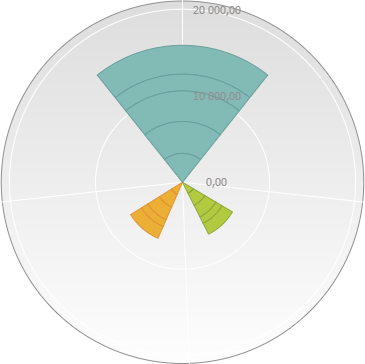

# Пример использования диаграммы с изменяемым радиусом

Пример использования диаграммы с изменяемым радиусом
-

# Пример использования диаграммы с изменяемым радиусом

Диаграмма с изменяемым радиусом сектора имеет две доступные метрики:

	- угол сектора - метрика, задаваемая через свойство [EaxRadiusAngleChartView.Props](EaxRadiusAngleChartView.Props.htm),
	 определяется значением одного из столбцов;

	- радиус сектора - стандартная метрика круговой диаграммы.

Для выполнения примера необходимо наличие компонента «kapBox» ([См.
 пример размещения компонента KapBox](dhtmlAdhoc.chm::/Components/KapBox/KapBox_example.htm)). В репозитории
 необходимо наличие экспресс-отчета, настроенного на представление диаграммы,
 содержащей несколько столбцов.

### Шаг 1

Доработаем код создания компонента «kapBox», перед строкой создания
 компонента:

kapBox = new Kap.KapBox ...
добавим код регистрации плагина, настроенного на первый столбец:

Kap.regPluginBlock({
      Id: "RadiusAngleChart",
      Name: "RadiusAngleChart",
      View: "PP.Exp.Ui.EaxRadiusAngleChartView",
      SourceClass: PP.App.ModuleType.Olap,
      Js: "../build/PP.RadiusAngleChartPlugin.js",
      Props: {
          pluginProps: { AnglePointIndex: "0" }
      }
});
В этом случае для аналитической панели появится возможность добавлять
 плагин.

### Шаг 2

Для добавления плагина используйте кнопку  «[Плагин](UiAdhoc.chm::/Blocks/Plugins/Plugins.htm)»,
 на вкладке ленты инструментов «Вставка».

### Шаг 3

После добавления плагина выберите источник данных диаграммы: экспресс-отчет
 с настроенной диаграммой.

В результате выполнения примера будет создана диаграмма, использующая
 первый столбец в качестве показателя угла, первый столбец также используется
 при отображении радиуса, так как не был скрыт свойством AnglePointVisible.

Для доступа к свойствам уже созданного блока, необходимо [получить
 экземпляр блока](dhtmlAdhoc.chm::/Classes/Dashboard/Dashboard.getBlock.htm). Скроем столбец, используемый в качестве
 угла сектора:

props = block.getProps();
props.AnglePointVisible = false;
block.setProps(props);
В результате выполнения кода первый столбец не будет отображаться в
 показателях радиуса, так как используется в показателе угла.

См. также:

[EaxRadiusAngleChartView](EaxRadiusAngleChartView.htm)

		Справочная
		 система на версию 10.9
		 от 18/08/2025,
		 © ООО «ФОРСАЙТ»,
