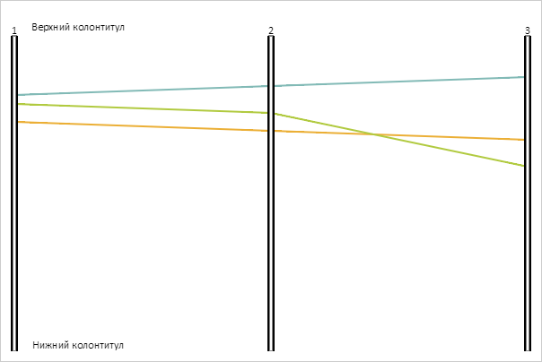

# PCArea.Footer

PCArea.Footer
-

# PCArea.Footer

## Синтаксис

Footer: [PP.Ui.ChartSVGLabel](dhtmlBubbleChart.chm::/Classes/BubbleChart/ChartSVGLabel/ChartSVGLabel.htm);

## Описание

Свойство Footer устанавливает
 нижний колонтитул области отрисовки диаграммы.

## Комментарии

Значение свойства устанавливается из JSON и с помощью метода setFooter,
 а возвращается с помощью метода getFooter.

## Пример

Для реализации примера необходимо наличие компонента [ParallelCoordinates](../../../Components/ParallelCoordinates/ParallelCoordinates.htm)
 с наименованием «coord» (см. «[Пример
 создания компонента ParallelCoordinates](../../../Components/ParallelCoordinates/Example_ParallelCoordinates.htm)»). Создадим и отрисуем на
 диаграмме верхний и нижний колонтитулы:

// Создаёт SVG-метку
function createLabel(text) {
    var labelData = {
        Height: 20,
        Text: text,
        Width: 50
    };
    return new PP.Ui.ChartSVGLabel(labelData);
}
function drawLabel(label, area) {
    var parentNode = coord.getChartArea().getLabelsLayer();
    label.draw(area, parentNode);
}
// Получаем область рисования диаграммы
var chartArea = coord.getChartArea();
// Создаём верхний колонтитул области
var header = createLabel("Верхний колонтитул");
// Отрисовываем заголовок
drawLabel(header, new PP.Rect("0, 0, 150, 10"));
// Создаём нижный колонтитул области
var footer = createLabel("Нижний колонтитул");
// Отрисовываем его
var freeArea = new PP.Rect();
freeArea.setTop(chartArea.getHeight() - 45);
freeArea.setHeight(10);
freeArea.setWidth(150);
drawLabel(footer, freeArea);
В результате выполнения примера на диаграмме были отрисованы верхний
 и нижний колонтитулы:

См. также:

[PCArea](PCArea.htm)

		Справочная
		 система на версию 10.9
		 от 18/08/2025,
		 © ООО «ФОРСАЙТ»,
