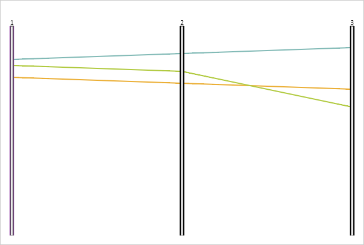

# PCAxis.BaseStroke

PCAxis.BaseStroke
-

# PCAxis.BaseStroke

## Синтаксис

BaseStroke: PP.[Color](dhtmlCommon.chm::/Classes/PP/Color/Color.htm)
 || String;

## Описание

Свойство BaseStroke определяет
 цвет основной линии оси диаграммы.

## Комментарии

Значение свойства устанавливается из JSON и с помощью метода setBaseStroke,
 а возвращается с помощью метода getBaseStroke.

## Пример

Для реализации примера необходимо наличие компонента [ParallelCoordinates](../../../Components/ParallelCoordinates/ParallelCoordinates.htm)
 с наименованием «coord» (см. «[Пример
 создания компонента ParallelCoordinates](../../../Components/ParallelCoordinates/Example_ParallelCoordinates.htm)»). Изменим цвет основной линии
 первой оси и обновим диаграмму:

// Устанавливаем цвет основной линии первой оси
coord.getAxes()[0].setBaseStroke("#AC6BBC");
// Отправляем запрос на обновление диаграммы
coord.requestRenderFrame();
В результате будет изменен цвет основной линии первой оси:

См. также:

[PCAxis](PCAxis.htm)

		Справочная
		 система на версию 10.9
		 от 18/08/2025,
		 © ООО «ФОРСАЙТ»,
