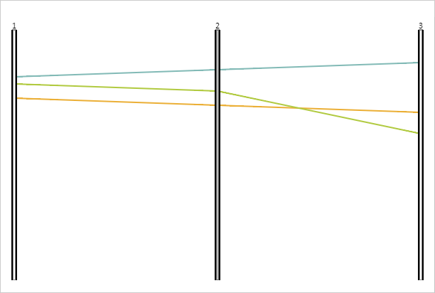

# PCAxis.RangeFill

PCAxis.RangeFill
-

# PCAxis.RangeFill

## Синтаксис

RangeFill: PP.[Color](dhtmlCommon.chm::/Classes/PP/Color/Color.htm)
 || String;

## Описание

Свойство RangeFill определяет
 цвет диапазона фильтрации.

## Комментарии

Значение свойства устанавливается из JSON и с помощью метода setRangeFill,
 а возвращается с помощью метода getRangeFill.

## Пример

Для реализации примера необходимо наличие компонента [ParallelCoordinates](../../../Components/ParallelCoordinates/ParallelCoordinates.htm)
 с наименованием «coord» (см. «[Пример
 создания компонента ParallelCoordinates](../../../Components/ParallelCoordinates/Example_ParallelCoordinates.htm)»). Установим новый цвет заливки
 для диапазона фильтрации второй оси:

// Получаем вторую ось
var axis2 = coord.getAxes()[1];
// Устанавливаем цвет заливки диапазона фильтрации для второй оси
axis2.setRangeFill("#BEBEBE", true);
// Обновляем диаграмму
axis2.getChart().refresh();
В результате выполнения примера для диапазона фильтрации второй оси
 был установлен серый цвет заливки:

См. также:

[PCAxis](PCAxis.htm)

		Справочная
		 система на версию 10.9
		 от 18/08/2025,
		 © ООО «ФОРСАЙТ»,
