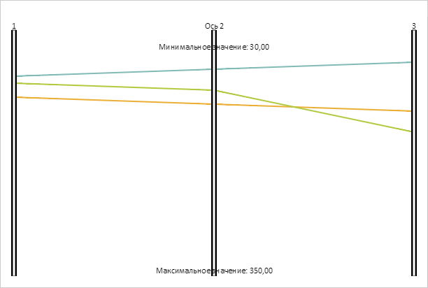

# PCAxis.RangeMaxLabel

PCAxis.RangeMaxLabel
-

# PCAxis.RangeMaxLabel

## Синтаксис

RangeMaxLabel: [PP.Ui.ChartSVGLabel](dhtmlBubbleChart.chm::/Classes/BubbleChart/ChartSVGLabel/ChartSVGLabel.htm);

## Описание

Свойство RangeMaxLabel определяет
 метку оси для максимального значения диапазона фильтрации.

## Комментарии

Значение свойства устанавливается из JSON и с помощью метода setRangeMaxLabel,
 а возвращается с помощью метода getRangeMaxLabel.

## Пример

Для реализации примера необходимо наличие компонента [ParallelCoordinates](../../../Components/ParallelCoordinates/ParallelCoordinates.htm)
 с наименованием «coord» (см. «[Пример
 создания компонента ParallelCoordinates](../../../Components/ParallelCoordinates/Example_ParallelCoordinates.htm)»). Установим для второй оси
 диаграммы минимальное и максимальное значения диапазона фильтрации, маски
 у соответствующих меток оси и новый заголовок:

// Получаем вторую ось
var axis2 = coord.getAxes()[1];
// Устанавливаем минимальное и максимальное значения диапазона фильтрации
axis2.setRangeMinValue(30);
axis2.setRangeMaxValue(350);
/* Устанавливаем маски у меток
для минимального и максимального значений диапазона фильтрации */
var minLabel = { MaskText: "Минимальное значение: {%Value:#,##.00}"};
axis2.setRangeMinLabel(minLabel);
var maxLabel = { MaskText: "Максимальное значение: {%Value:#,##.00}"};
axis2.setRangeMaxLabel(maxLabel);
// Устанавливаем расположение меток
var x = Math.round(axis2.getX());
var minY = Math.round(axis2.getRangeMinValue());
var maxY = Math.round(axis2.getRangeMaxValue() -
    axis2.getRangeMaxLabel().getRealHeight());
axis2.getRangeMinLabel().setPosition(x, minY);
axis2.getRangeMaxLabel().setPosition(x, maxY);
// Устанавливаем заголовок оси
axis2.setHeader({ Text: "Ось 2" });
axis2.getHeader().setPosition(Math.round(x), 0);
// Перерисовываем ось
axis2.draw();
В результате выполнения примера для второй оси диаграммы были установлены
 минимальное и максимальное значения диапазона фильтрации, маски у соответствующих
 меток оси и новый заголовок:

См. также:

[PCAxis](PCAxis.htm)

		Справочная
		 система на версию 10.9
		 от 18/08/2025,
		 © ООО «ФОРСАЙТ»,
