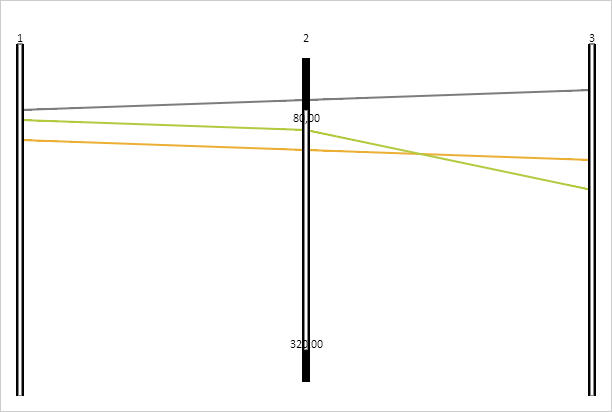

# PCAxis.activateResizer

PCAxis.activateResizer
-

# PCAxis.activateResizer

## Синтаксис

activateResizer(coords: Object);

## Параметры

coords. Объект с координатами,
 в которых активируется элемент изменения размера. Объект должен содержать
 поля X и Y.

## Описание

Метод activateResizer активирует
 элемент изменения размера диапазона фильтрации оси.

## Пример

Для реализации примера необходимо наличие компонента [ParallelCoordinates](../../../Components/ParallelCoordinates/ParallelCoordinates.htm)
 с наименованием «coord» (см. «[Пример
 создания компонента ParallelCoordinates](../../../Components/ParallelCoordinates/Example_ParallelCoordinates.htm)»). Создадим новый преобразователь
 данных и новый объект для сопоставления данных. Установим новый объект
 для сопоставления данных второй оси:

// Включаем фильтрацию у диаграммы
coord.setFiltrationEnabled(true);
// Создаем функцию, которая будет применяться для линий, попадающий за границы диапазона фильтрации
var filter = new PP.Object({});
filter.apply = function (color) {
    color.setR(125);
    color.setG(125);
    color.setB(125);
};
coord.setFilterInactiveEffects([filter]);
// Создаем преобразователь данных
PP.MyTransformer = function (settings) {
    PP.MyTransformer.base.constructor.apply(this, arguments);
};
PP.initClass(PP.MyTransformer, PP.NormalizationTransformer, 'PP.MyTransformer', ['PP.IDataAdapter']);
var myTransP = PP.MyTransformer.prototype;
// Определяем методы обработки значени
myTransP.getData = function (value) {
    return value;
};
myTransP.getValue = function (value) {
    return value;
};
myTransP.init = myTransP.getMinData = myTransP.getMaxData = function (data) { };
// Создаем объект для сопоставления данных из источника элементам диаграммы
var newMapping = new PP.DataMapping({
    DataSource: dataSource,
    DimAttributeId: "id2",
    Type: "Transformer",
});
newMapping.setDataTransformer(new PP.MyTransformer());
coord.getAxes()[1].setMapping(newMapping);
Активируем элемент изменения размера нижней границы диапазона фильтрации
 второй оси и изменяем его:

// Активируем элемент изменения размера нижней границы диапазона фильтрации второй оси
coord.getAxes()[1].activateResizer({
    X: 290,
    Y: 14
});
// Изменяем нижний диапазон фильтрации
coord.getAxes()[1].moveResizerTo({ Y: 80 });
Активируем элемент изменения размера верхней границы диапазона фильтрации
 второй оси, изменяем его и обновляем диаграмму:

// Активируем элемент изменения размера верхней границы диапазона фильтрации второй оси
coord.getAxes()[1].activateResizer({
    X: 290,
    Y: 366
});
// Изменяем верхний диапазон фильтрации
coord.getAxes()[1].moveResizerTo({ Y: 320 });
// Обновляем диаграмму
coord.refresh();
В результате у второй оси будет установлен новый диапазон фильтрации.
 Первая линия попадает за пределы диапазона фильтрации, поэтому ее цвет
 будет изменен на серый:

Сдвигаем диапазон фильтрации второй оси вниз:

// Сдвигаем диапазон фильтрации вниз
coord.getAxes()[1].moveRangeBy(5);
// Обновляем диаграмму
coord.refresh();
В результате диапазон фильтрации второй оси будет сдвинут вниз:

См. также:

[PCAxis](PCAxis.htm)

		Справочная
		 система на версию 10.9
		 от 18/08/2025,
		 © ООО «ФОРСАЙТ»,
