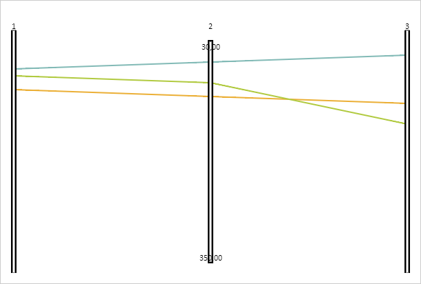

# PCAxis.isFiltered

PCAxis.isFiltered
-

# PCAxis.isFiltered

## Синтаксис

isFiltered(value: Number);

## Параметры

value. Значение проверяемой
 Y-координаты линии.

## Описание

Метод isFiltered проверяет попадание
 линии оси в диапазон фильтрации.

## Комментарии

Метод возвращает значение true,
 если прямая попадает в диапазон фильтрации, значение false,
 если прямая находится за пределами диапазона фильтрации и значение null, если диапазон фильтрации не
 задан.

## Пример

Для реализации примера необходимо наличие компонента [ParallelCoordinates](../../../Components/ParallelCoordinates/ParallelCoordinates.htm)
 с наименованием «coord» (см. «[Пример
 создания компонента ParallelCoordinates](../../../Components/ParallelCoordinates/Example_ParallelCoordinates.htm)»). Проверим, запущена ли фильтрация
 у второй оси, и если не запущена, то установим границы фильтрации:

// Проверяем, запущена ли фильтрация у второй оси диаграммы
if (coord.getAxes()[1].isFiltrationActive()) {
    console.log("Фильтрация у второй оси уже запущена");
} else {
    console.log("Запускается фильтрация для второй оси...");
    coord.getAxes()[1].setRangeMinValue(30);
    coord.getAxes()[1].setRangeMaxValue(350);
    coord.getAxes()[1].draw();
};
coord.refresh();
В результате выполнения примера в консоль будет выведено сообщение о
 запуске фильтрации для второй оси:

Запускается фильтрация для второй оси...

У второй оси будут установлены границы диапазона фильтрации:

Проверим нахождение первой линии в диапазоне фильтрации второй оси:

// Проверяем нахождение первой линии в диапазон фильтрации второй оси
if (coord.getAxes()[1].isFiltered(dataSource.getData("line1", 0, "id2"))) {
    console.log("Первая линия находится в диапазоне фильтрации второй оси");
} else {
    console.log("Первая линия находится за пределами диапазона фильтрации второй оси");
}
В результате в консоль будет выведен результат проверки:

Первая линия находится в диапазоне фильтрации второй
 оси

Проверим, была ли скрыта первая линия после установления фильтрации
 второй оси:

// Проверяем, была ли скрыта первая линия после установления фильтрации оси
if (coord.getLines()[0].getIsFiltered()) {
    console.log("Первая линия скрыта после установления фильтрации");
} else {
    console.log("Первая линия видна после установления фильтрации");
}
В результате в консоль будет выведен результат проверки:

Первая линия видна после установления фильтрации

См. также:

[PCAxis](PCAxis.htm)

		Справочная
		 система на версию 10.9
		 от 18/08/2025,
		 © ООО «ФОРСАЙТ»,
