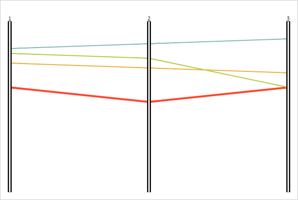

# Конструктор PCLine

Конструктор PCLine
-

# Конструктор PCLine

## Синтаксис

PP.Ui.PCLine(settings);

## Параметры

settings. JSON-объект со значениями
 свойств компонента.

## Описание

Конструктор PCLine создает линию
 диаграммы.

## Пример

Для реализации примера необходимо наличие компонента [ParallelCoordinates](../../../Components/ParallelCoordinates/ParallelCoordinates.htm)
 с наименованием «coord» (см. «[Пример
 создания компонента ParallelCoordinates](../../../Components/ParallelCoordinates/Example_ParallelCoordinates.htm)»). Создаем новую линию и добавляем
 ее к диаграмме:

// Создаем новую линию
line = new PP.Ui.PCLine({
    Chart: coord,
    Id: "line4",
});
// Добавляем новые данные
dataSource.setItemName(line.getId(), "Линия 4");
dataSource.add(line.getId(), new PP.TimeAxis({ Items: [150] }), "id1");
dataSource.add(line.getId(), new PP.TimeAxis({ Items: [180] }), "id2");
dataSource.add(line.getId(), new PP.TimeAxis({ Items: [150] }), "id3");
// Устанавливаем цвет линии
line.setColor(coord.getLinesColors()[4]);
// Устанавливаем толщину линии
line.setThickness(4);
line.draw();
// Добавляем линию к диаграмме
coord.getLines().push(line);
В результате к диаграмме будет добавлена новая линия:

См. также:

[PCLine](PCLine.htm)

		Справочная
		 система на версию 10.9
		 от 18/08/2025,
		 © ООО «ФОРСАЙТ»,
