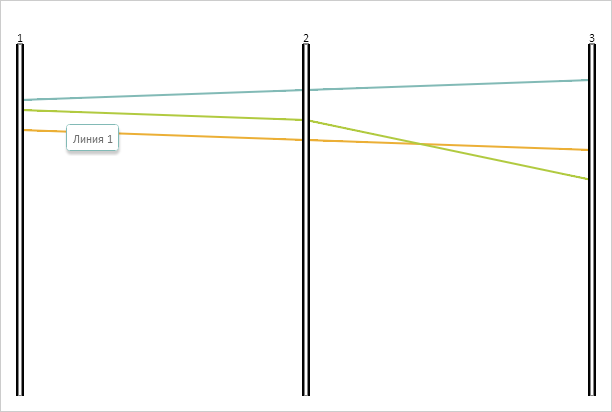

# PCLine.toggleTooltip

PCLine.toggleTooltip
-

# PCLine.toggleTooltip

## Синтаксис

toggleTooltip(coord: Object);

## Параметры

coord. Объект с X-координатой,
 где отображается всплывающая подсказка. Объект должен содержать поле X.

## Описание

Метод toggleTooltip отображает/скрывает
 всплывающую подсказу линии диаграммы.

## Пример

Для реализации примера необходимо наличие компонента [ParallelCoordinates](../../../Components/ParallelCoordinates/ParallelCoordinates.htm)
 с наименованием «coord» (см. «[Пример
 создания компонента ParallelCoordinates](../../../Components/ParallelCoordinates/Example_ParallelCoordinates.htm)»). Получаем цвет границы и
 текстовое значение всплывающей подсказки первой линии:

// Получаем первую линию диаграммы
line = coord.getLines()[0];
// Получаем цвет границы всплывающей подсказки первой линии
console.log("Цвет границы всплывающей подсказки первой линии: " + line.getTooltipColor());
// Получаем текстовое значение всплывающей подсказки первой линии
console.log("Текстовое значение всплывающей подсказки первой линии: " + line.getTooltipValues().Name);
В результате в консоль будут выведены цвет границы и текстовое значение
 всплывающей подсказки первой линии:

Цвет границы всплывающей подсказки первой линии:
 #82BAB6

Текстовое значение всплывающей подсказки первой
 линии: Линия 1

Устанавливаем отображение всплывающей подсказки первой линии по нажатию
 на линию и отображаем ее:

// Устанавливаем отображение всплывающей подсказки первой линии по нажатию на линию
line.getTooltip().setHoverMode(PP.HoverMode.Click);
// Отображаем всплывающую подсказку первой линии
line.toggleTooltip({
    X: 50
});
// Обновляем диаграмму
coord.refresh();
В результате будет отображена всплывающая подсказка первой линии:

См. также:

[PCLine](PCLine.htm)

		Справочная
		 система на версию 10.9
		 от 18/08/2025,
		 © ООО «ФОРСАЙТ»,
