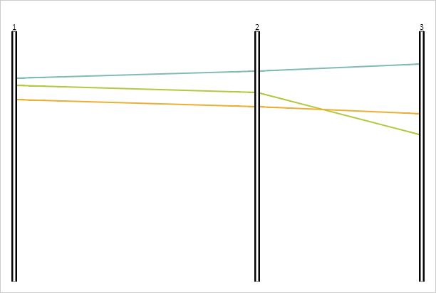

# PCObject.animate

PCObject.animate
-

# PCObject.animate

## Синтаксис

animate(step: Number);

## Параметры

step. Шаг анимации.

## Описание

Метод animate рассчитывает положение
 объекта, согласно шагу анимации.

## Пример

Для реализации примера необходимо наличие компонента [ParallelCoordinates](../../../Components/ParallelCoordinates/ParallelCoordinates.htm)
 с наименованием «coord» (см. «[Пример
 создания компонента ParallelCoordinates](../../../Components/ParallelCoordinates/Example_ParallelCoordinates.htm)»). Зададим X-координату второй
 оси диаграммы и рассчитаем ее положение при анимировании:

// Задаем X-координату второй оси
coord.getAxes()[1].setX(400);
// Рассчитываем новое положение
coord.getAxes()[1].animate(0.5);
// Перерисовываем оси и линии диаграммы
coord.getChartArea().getLinesLayer().clear();
coord.getChartArea().getAxesLayer().clear();
for (var i in coord.getAxes()) {
    coord.getAxes()[i].renderFrame(coord.getChartArea().getAxesLayer());
}
for (var i in coord.getLines()) {
    coord.getLines()[i].renderFrame(coord.getChartArea().getLinesLayer());
}
В результате вторая ось будет находиться в другом положении:

См. также:

[PCObject](PCObject.htm)

		Справочная
		 система на версию 10.9
		 от 18/08/2025,
		 © ООО «ФОРСАЙТ»,
