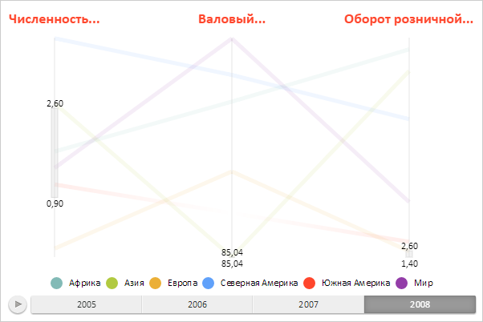

# ParallelCoordinates.Axis

ParallelCoordinates.Axis
-

# ParallelCoordinates.Axis

## Синтаксис

Axis: Object;

## Описание

Свойство Axis определяет шаблон
 настроек для осей диаграммы.

## Комментарии

Значение свойства устанавливается из JSON, а возвращается с помощью
 метода getAxis.

Свойство Axis используется для
 автоматического создания осей диаграммы, если не задано значение для свойства
 [ParallelCoordinates.Axes](ParallelCoordinates.Axes.htm). Шаблон
 настроек представляет собой JSON-объект, поля которого являются свойствами
 класса [PCAxis](../PCAxis/PCAxis.htm).

## Пример

Для выполнения примера необходимо создать html-страницу и выполнить
 следующие действия:

1. Добавить ссылку на css-файл PP.css. Также нужно добавить ссылки
 на следующие js-файлы:

	- PP.js;

	- PP.GraphicsBase.js;

	- PP.ParallelCoordinates.js;

2. В теге <body> разместить блок с идентификатором «area» для
 хранения диаграммы с параллельными координатами;

3. Далее в теге <body> необходимо добавить сценарий, создающий
 диаграмму с параллельными координатами и с указанным шаблоном настроек
 для её осей и линий:

// Устанавливаем путь к папке с изображениями
PP.ImagePath = '../../../../../build/img/';
// Устанавливаем настройки диаграммы с параллельными координатами
var options = {
        "Axis": {
            // Цвет основной линии оси диаграммы
            "BaseStroke": "#44CCCCCC",
            // Толщина основной линии оси
            "BaseThickness": "2",
            // Цвет диапазона фильтрации
            "RangeFill": "#44CCCCCC",
            // Цвет контура диапазона фильтрации
            "RangeStroke": "#99CCCCCC",
            // Ширина диапазона фильтрации
            "RangeThickness": "8",
            // Минимальное значение диапазона фильтрации
            "RangeMinValue": "0.9",
            // максимальное значение диапазона фильтрации
            "RangeMaxValue": "2.6",
            // Заголовок оси диаграммы
            "Header": {
                "Style": {
                    "Release": {
                        "Font": {
                            "Color": "#ff462c",
                            "IsBold": "True",
                            "Size": "18"
                        }
                    }
                }
            },
            // Метка оси для минимального значения диапазона фильтрации
            "RangeMinLabel": {
                "Style": {
                    "Release": {
                        "Font": {
                            "Color": "#000000"
                        }
                    }
                }
            },
            // Метка оси для максимального значения диапазона фильтрации
            "RangeMaxLabel": {
                "Style": {
                    "Release": {
                        "Font": {
                            "Color": "#000000"
                        }
                    }
                }
            }
        },
        // Легенда диаграммы
        "Legends": {
            "legend0": {
                "Type": "Intervals",
                "Header": {}
            }
        },
        // Временная шкала
        "Timeline": {
            "StepsNames": ["2005", "2006", "2007", "2008"]
        },
        // Настройки сопосотавления данных
        "Visuals": {
            "main": {
                "PPType": "PP.Ui.PCVisual",
                "DataSource": "ds0",
                "Mappings": {
                    "mapping0": {
                        "Id": "mapping0",
                        "DimAttributeId": "attr0",
                        "Type": "Transformer",
                        "DataTransformer": {
                            "PPType": "PP.CoordinateTransformer"
                        }
                    },
                    "mapping1": {
                        "Id": "mapping1",
                        "DimAttributeId": "attr1",
                        "Type": "Transformer",
                        "DataTransformer": {
                            "PPType": "PP.CoordinateTransformer"
                        }
                    },
                    "mapping2": {
                        "Id": "mapping2",
                        "DimAttributeId": "attr2",
                        "Type": "Transformer",
                        "DataTransformer": {
                            "PPType": "PP.CoordinateTransformer"
                        }
                    }
                }
            },
            "color": {
                "PPType": "PP.ColorVisual",
                "ColorMapping": {
                    "Scale": {
                        "TypeArguments": "Brush",
                        "Items": "#99ff462c #99ebaf36 #99ffd900 #99b1ca40 #996a8535"
                    },
                    "Type": "Scale"
                }
            }
        },
        // Источник данных диаграммы
        "DataSources": {
            "ds0": {
                "Id": "ds0",
                "AttributesNames": {
                    "attr0": "Численность постоянного населения (всего, тыс. чел.)",
                    "attr1": "Валовый региональный продукт (млн. руб.)",
                    "attr2": "Оборот розничной торговли, млд. руб."
                },
                "ItemsNames": {
                    "O38003400300034003200": "Африка",
                    "O38003400300033003800": "Азия",
                    "O3300310036003400370038003000": "Европа",
                    "O310039003200370038003000": "Северная Америка",
                    "O3300310036003400380030003000": "Южная Америка",
                    "O38003400300031003200": "Мир",
                },
                "Series": {
                    "O38003400300034003200": {
                        "attr0": {
                            "Items": "1.48190591 1.59584524 1.69484782 1.77443946"
                        },
                        "attr1": {
                            "Items": "109.48656 109.99307 111.31474 109.95764"
                        },
                        "attr2": {
                            "Items": "42.90528949 40.87774911 37.18942016 41.14330847"
                        }
                    },
                    "O38003400300033003800": {
                        "attr0": {
                            "Items": "2.60307468 2.6364252 2.66619155 2.69506159"
                        },
                        "attr1": {
                            "Items": "101.82519 102.85029 94.18395 85.03809"
                        },
                        "attr2": {
                            "Items": "43.38438688 38.52309016 34.86914099 37.02317165"
                        }
                    },
                    "O3300310036003400370038003000": {
                        "attr0": {
                            "Items": "-0.23692341 -0.18961622 -0.13965343 -0.07433788"
                        },
                        "attr1": {
                            "Items": "102.06544 99.21836 98.16013 98.75872"
                        },
                        "attr2": {
                            "Items": "1.66250417 1.39672431 1.49987782 2.52080851"
                        }
                    },
                    "O310039003200370038003000": {
                        "attr0": {
                            "Items": "2.74184965 3.44912559 3.94439543 3.93249117"
                        },
                        "attr1": {
                            "Items": "118.15176 113.93954 113.0123 114.23096"
                        },
                        "attr2": {
                            "Items": "29.71075271 28.53453398 24.54912505 27.78798884"
                        }
                    },
                    "O3300310036003400380030003000": {
                        "attr0": {
                            "Items": "1.47430971 1.34308393 1.22511846 1.14711313"
                        },
                        "attr1": {
                            "Items": "NULL NULL NULL NULL"
                        },
                        "attr2": {
                            "Items": "3.02967435 3.38699726 5.97802034 4.33109101"
                        }
                    },
                    "O38003400300031003200": {
                        "attr0": {
                            "Items": "1.53168406 1.51072338 1.48751165 1.46045335"
                        },
                        "attr1": {
                            "Items": "120.09725 120.19888 120.2091 120.07056"
                        },
                        "attr2": {
                            "Items": "8.61129651 9.60846507 8.86245571 11.92132783"
                        }
                    }
                }
            }
        }
    }
    // Указываем родительский элемент
options.ParentNode = document.getElementById("area");
// Устанавливаем размеры диаграммы
options.Width = 600;
options.Height = 400;
// Устанавливаем настройки для линий
options.Line = {
    Thickness: 5
};
var coord = new PP.Ui.ParallelCoordinates(options);
В результате выполнения примера была создана диаграмма с параллельными
 координатами и с указанным шаблоном настроек для её осей и линий:

См. также:

[ParallelCoordinates](ParallelCoordinates.htm)

		Справочная
		 система на версию 10.9
		 от 18/08/2025,
		 © ООО «ФОРСАЙТ»,
