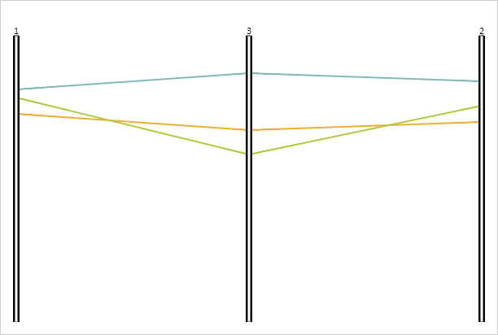

# ParallelCoordinates.AxisDragEnabled

ParallelCoordinates.AxisDragEnabled
-

# ParallelCoordinates.AxisDragEnabled

## Синтаксис

AxisDragEnabled: Boolean;

## Описание

Свойство AxisDragEnabled определяет,
 можно ли перемещать оси диаграммы.

## Комментарии

Допустимые значения:

	- true.
	 Перенос осей разрешен (по умолчанию);

	- false.
	 Перенос осей невозможен.

Значение свойства устанавливается из JSON и с помощью метода setAxisDragEnabled,
 а возвращается с помощью метода getAxisDragEnabled.

## Пример

Для реализации примера необходимо наличие компонента [ParallelCoordinates](../../../Components/ParallelCoordinates/ParallelCoordinates.htm)
 с наименованием «coord» (см. «[Пример
 создания компонента ParallelCoordinates](../../../Components/ParallelCoordinates/Example_ParallelCoordinates.htm)»). Включим возможность переноса
 осей диаграммы и перенесем третью ось:

// Включаем возможность переноса осей
coord.setAxisDragEnabled(true);
Перенесем третью ось. В результате оси будут расположены по-другому:

См. также:

[ParallelCoordinates](ParallelCoordinates.htm)

		Справочная
		 система на версию 10.9
		 от 18/08/2025,
		 © ООО «ФОРСАЙТ»,
