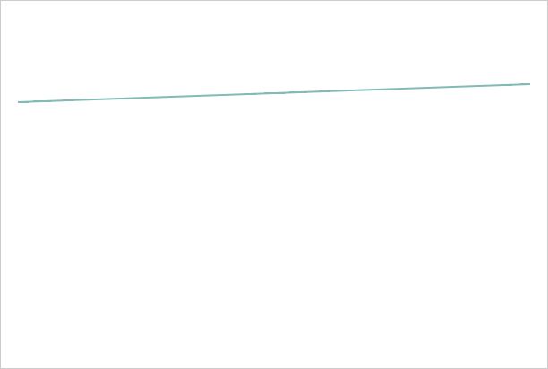

# ParallelCoordinates.ChartArea

ParallelCoordinates.ChartArea
-

# ParallelCoordinates.ChartArea

## Синтаксис

ChartArea: PP.Ui.[PCArea](../PCArea/PCArea.htm);

## Описание

Свойство ChartArea определяет
 область рисования диаграммы.

## Комментарии

Значение свойства устанавливается из JSON, а возвращается с помощью
 метода getChartArea.

## Пример

Для реализации примера необходимо наличие компонента [ParallelCoordinates](../../../Components/ParallelCoordinates/ParallelCoordinates.htm)
 с наименованием «coord» (см. «[Пример
 создания компонента ParallelCoordinates](../../../Components/ParallelCoordinates/Example_ParallelCoordinates.htm)»). Очистим слои осей, линий,
 меток области рисования диаграммы и нарисуем первую линию:

//Очищаем слой осей диаграммы
coord.getChartArea().getAxesLayer().clear();
// Очищаем слой линий диаграммы
coord.getChartArea().getLinesLayer().clear();
// Очищаем слой меток диаграммы
var arr = coord.getChartArea().getLabelsLayer().children;
for (var i = arr.length-1; i >= 0; i--) {
    arr[i].remove();
}
coord.getChartArea().setFooter({ Text: "Ось 2" });
// Рисуем только первую линию
coord.getLines()[0].renderFrame(coord.getChartArea().getPaper());
В результате на диаграмме будет нарисована только первая линия:

Скроем первую линию:

coord.getLines()[0].hide();
В результате диаграмма будет очищена.

См. также:

[ParallelCoordinates](ParallelCoordinates.htm)

		Справочная
		 система на версию 10.9
		 от 18/08/2025,
		 © ООО «ФОРСАЙТ»,
