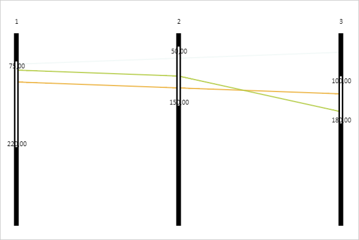

# ParallelCoordinates.FilterActiveEffects

ParallelCoordinates.FilterActiveEffects
-

# ParallelCoordinates.FilterActiveEffects

## Синтаксис

FilterActiveEffects: Array;

## Описание

Свойство FilterActiveEffects
 определяет эффекты для линий диаграммы, входящих в диапазон фильтрации.

## Комментарии

Значение свойства устанавливается из JSON и с помощью метода setFilterActiveEffects,
 а возвращается с помощью метода getFilterActiveEffects.

## Пример

Для реализации примера необходимо наличие компонента [ParallelCoordinates](../../../Components/ParallelCoordinates/ParallelCoordinates.htm)
 с наименованием «coord» (см. «[Пример
 создания компонента ParallelCoordinates](../../../Components/ParallelCoordinates/Example_ParallelCoordinates.htm)»). Установим диапазон фильтрации
 и определим для линий, входящих в заданный диапазон, прозрачность цвета,
 равную 0,85:

// Устанавливает диапазон фильтрации
function setFilterRange(min, max, index) {
    // Получаем оси диаграммы
    var axes = coord.getAxes();
    for(var i in axes) {
        if(i == index) {
            var axis = axes[i];
            axis.setRangeMinValue(min);
            axis.setRangeMaxValue(max);
            // Перерисовываем ось диаграммы
            axis.draw();
        }
    }
}
// Устанавливаем диапазон фильтрации для диаграммы
setFilterRange(75, 220, 0);
setFilterRange(50, 150, 1);
setFilterRange(100, 180, 1);
// Создаём эффект прозрачности для линий диаграммы
opacityEffect = new PP.Ui.OpacityEffect({
    Opacity: 0.85
});
// Применяем данный эффект для линий, входящих в диапазон фильтрации
coord.setFilterActiveEffects([opacityEffect]);
// Перерисовываем диаграмму
coord.draw();
В результате выполнения примера для линий, входящих в заданный диапазон
 фильтрации, была установлена прозрачность цвета, равная 0,85:

См. также:

[ParallelCoordinates](ParallelCoordinates.htm)

		Справочная
		 система на версию 10.9
		 от 18/08/2025,
		 © ООО «ФОРСАЙТ»,
