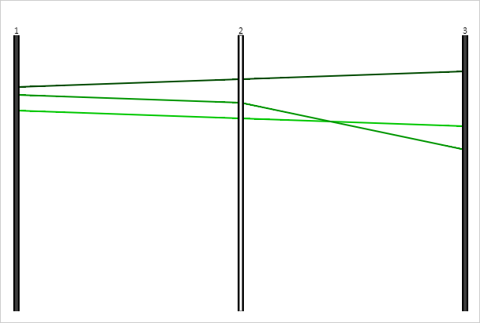

# ParallelCoordinates.SelectedAxis

ParallelCoordinates.SelectedAxis
-

# ParallelCoordinates.SelectedAxis

## Синтаксис

SelectedAxis: [PP.Ui.PCAxis](../PCAxis/PCAxis.htm);

## Описание

Свойство SelectedAxis определяет
 выделенную ось диаграммы.

## Комментарии

Значение свойства устанавливается из JSON и с помощью метода setSelectedAxis,
 а возвращается с помощью метода getSelectedAxis.

## Пример

Для реализации примера необходимо наличие компонента [ParallelCoordinates](../../../Components/ParallelCoordinates/ParallelCoordinates.htm)
 с наименованием «coord» (см. «[Пример
 создания компонента ParallelCoordinates](../../../Components/ParallelCoordinates/Example_ParallelCoordinates.htm)»). Установим настройки сопоставления
 данных диаграммы цветам её линий, определим тип данного сопоставления,
 запретим выделение первой оси и разрешим выделение второй оси:

// Создаём настройки сопоставления данных диаграммы цветам линий
var colorMap = new PP.DataMapping({
    DataSource: dataSource,
    Type: PP.DataMappingType.Scale,
    Scale: new PP.ScaleBase({
        Values: [50.0, 60.0, 70.0, 80.0, 90.0, 100.0, 110.0, 120.0, 130.0],
        Items: ["#001900", "#003200", "#004B00", "#006400",
            "#007D00", "#009600", "#00AF00", "#00C800", "#00E100"],
        EnableEquality: "false",
        NoData: "#CCCCCC",
        TypeArguments: "Brush"
    })
});
var visual = new PP.ColorVisual({
    ColorMapping: colorMap
});
// Устанавливаем настройки сопоставления данных
coord.setVisuals([visual]);
// Проверим наличие объекта для сопоставления данных визуализатора
if (coord.getColorVisual() !== undefined) {
    //console.log("Объект для сопоставления данных визуализатора задан");
    console.log("Тип сопоставления данных: %s", coord.getColorVisual().getColorMapping().getType());
}
// Выделяет ось диаграммы
function selectAxis(index) {
    // Получаем оси диаграммы
    var axes = coord.getAxes();
    // Пытаемся выделить ось диаграммы
    coord.setSelectedAxis(axes[index]);
    // Перерисовываем диаграмму
    coord.draw();
    if(coord.getSelectedAxis()) {
        // Получаем идентификатор выделенной оси диаграммы
        console.log("Выделена ось с индексом %s", index);
    } else {
        console.log("Ось с индексом %s не выделена", index);
    }
}
// Запрещаем выделение осей диаграммы
coord.setAxisSelectionEnabled(false);
// Пытаемся выделить первую ось диаграммы
selectAxis(0);
// Разрешаем выделение осей диаграммы
coord.setAxisSelectionEnabled(true);
// Пытаемся выделить первую ось диаграммы
selectAxis(1);
В результате выполнения примера были установлены настройки сопоставления
 данных диаграммы цветам её линий. Выделение первой оси диаграммы была
 запрещено, а второй - разрешено:

Соответствующие уведомления были выведены в консоли браузера:

Тип сопоставления данных: Scale

Ось с индексом 0 не выделена

Выделена ось с индексом 1

См. также:

[ParallelCoordinates](ParallelCoordinates.htm)

		Справочная
		 система на версию 10.9
		 от 18/08/2025,
		 © ООО «ФОРСАЙТ»,
