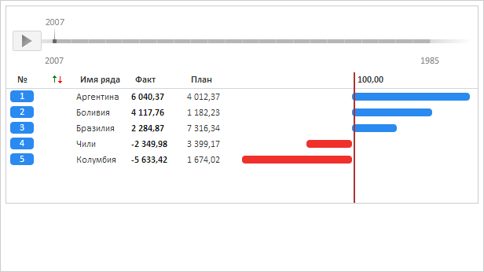

# RatingChart.DateChanged

RatingChart.DateChanged
-

**

# RatingChart.DateChanged

## Синтаксис

DateChanged: function(sender, args);

## Параметры

sender. Источник события;

args. Информация о событии.
 Доступные аргументы: Name - изменённое значение, TimeSlice - временной
 срез.

## Описание

Событие DateChanged** генерируется
 после изменения временной линии рейтинговой диаграммы.

## Пример

Для выполнения примера необходимо наличие на html-странице компонента
 [RatingChart](../../Components/RatingChart/RatingChart.htm)
 с наименованием «ratingChart» (см. «[Пример
 создания компонента RatingChart](../../Components/RatingChart/RatingChart_Example.htm)»). Заменим внешнюю временную шкалу
 на собственную шкалу рейтинговой диаграммы и разместим её сверху:

// Обработаем событие DateChanged
ratingChart.DateChanged.add(function (sender, args) {
    if (args.Name != undefined) {
        console.log("Текущий год на временной шкале: " + args.Name);
    }
});
// Скроем внешнюю шкалу
ratingChart.getTimeline().hide();
// Установим для рейтинговой диаграммы собственную школу
ratingChart.setTimeline();
// Шкалу будем отображать сверху от диаграммы
ratingChart.setTimelinePosition(PP.LTRB.Top);

В результате выполнения примера была скрыта внешняя временная шкала
 и сверху отображена собственная шкала диаграммы:

Также в консоли браузера был выведен текущий год на временной шкале:

Текущий год на временной шкале: 2007

[RatingChart](RatingChart.htm)

		Справочная
		 система на версию 10.9
		 от 18/08/2025,
		 © ООО «ФОРСАЙТ»,
