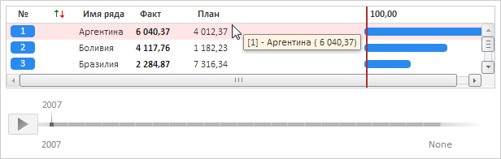
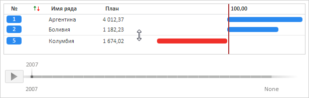

# RatingChart.ShowSplitter

RatingChart.ShowSplitter
-

**

# RatingChart.ShowSplitter

## Синтаксис

ShowSplitter: Boolean;

## Описание

Свойство ShowSplitter**
 определяет признак отображения разделителя в рейтинговой диаграмме.

## Комментарии

Значение свойства устанавливается из JSON и с помощью метода set**ShowSplitter**,
 а возвращается с помощью метода get**ShowSplitter**.

Допустимые значения:

	- true.
	 Если количество рядов диаграммы больше, чем входит в контейнер, будет
	 отображаться разделитель;

	- false. Значение по умолчанию.
	 Если количество рядов диаграммы больше, чем входит в контейнер, будет
	 отображаться полоса прокрутки.

Для определения начального количества расположенных над разделителем
 рядов данных используйте свойство [RatingChart.SplittedTop](RatingChart.SplittedTop.htm).

## Пример

Для выполнения примера необходимо наличие на html-странице компонента
 [RatingChart](../../Components/RatingChart/RatingChart.htm)
 с наименованием «ratingChart» (см. «[Пример
 создания компонента RatingChart](../../Components/RatingChart/RatingChart_Example.htm)»). Изменим высоту рейтинговой диаграммы:

ratingChart.setHeight(100);

По умолчанию в диаграмме отображается полоса прокрутки и все столбцы
 значений, а при наведении курсором мыши на любой ряд диаграммы - всплывающая
 подсказка:

Разрешим отображение разделителя в диаграмме, скроем активный столбец
 значений рядов и запретим отображение всплывающей подсказки:

// Отобразим разделитель
ratingChart.setShowSplitter(true);
// Всплывающие подсказки отображать не будем
ratingChart.setShowToolTip(false);
// Скроем активный столбец значений
activeColumn = ratingChart.getActiveColumn();
activeColumn.setIsVisible(false);

В результате выполнения примера будет добавлен разделитель. При наведении
 курсором мыши на любой ряд диаграммы не будет появляться всплывающая подсказка,
 столбец значений «Факт» будет скрыт:

См. также:

[RatingChart](RatingChart.htm)

		Справочная
		 система на версию 10.9
		 от 18/08/2025,
		 © ООО «ФОРСАЙТ»,
