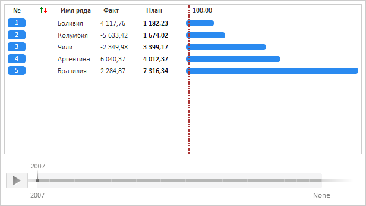

# RatingChart.SortMethod

RatingChart.SortMethod
-

**

# RatingChart.SortMethod

## Синтаксис

SortMethod: [PP.Sorting](dhtmlCommon.chm::/Enums/Sorting.htm);

## Описание

Свойство SortMethod** определяет
 режим сортировки элементов в рейтинговой диаграмме.

## Комментарии

Значение свойства устанавливается из JSON и с помощью метода setSortMethod,
 а возвращается с помощью метода getSortMethod.

По умолчанию свойство содержит значение PP.Sorting.Descending.

## Пример

Для выполнения примера необходимо наличие на html-странице компонента
 [RatingChart](../../Components/RatingChart/RatingChart.htm)
 с наименованием «ratingChart» (см. «[Пример
 создания компонента RatingChart](../../Components/RatingChart/RatingChart_Example.htm)»). Отсортируем элементы рейтинговой
 диаграммы по возрастанию значений из столбца «План» и обработаем события
 начала и окончания сортировки:

ratingChart.beginUpdate();
// Разрешим использование анимации
ratingChart.setUseAnimation(true);
// Обработаем событие Sorting
ratingChart.Sorting.add(function (sender, args) {
    console.log("Начало воспроизведения анимации сортировки элементов диаграммы");
    console.log("Индекс периода времени: " + args.TimeSlice);
    console.log("Индекс активного столбца диаграммы: " + args.ActiveColumn);
});
// Обработаем событие Sorted
ratingChart.Sorted.add(function (sender, args) {
    console.log("Окончание воспроизведения анимации сортировки элементов диаграммы");
    console.log("Режим сортировки: " + args.Method);
});
// Установим сортировку по возрастанию
ratingChart.setSortMethod(PP.Sorting.Ascending);
ratingChart.draw(false);
ratingChart.endUpdate();

В результате выполнения примера элементы рейтинговой диаграммы были
 отсортированы по возрастанию значений из столбца «План»:

В консоли браузера были выведены уведомления о начале и окончании воспроизведения
 анимации сортировки элементов, а также текущие индексы периода времени,
 активного столбца диаграммы и наименование режима сортировки:

Начало воспроизведения анимации сортировки элементов
 диаграммы

Индекс периода времени: 0

Индекс активного столбца диаграммы: 1

Окончание воспроизведения анимации сортировки элементов диаграммы

Режим сортировки: Ascending

См. также:

[RatingChart](RatingChart.htm)

		Справочная
		 система на версию 10.9
		 от 18/08/2025,
		 © ООО «ФОРСАЙТ»,
