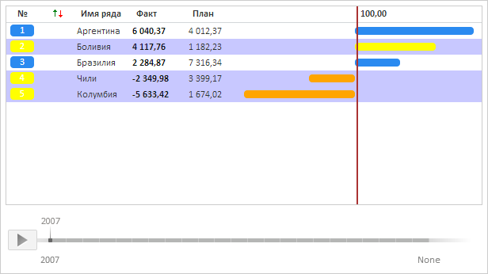

# RatingChart.getSelection

RatingChart.getSelection
-

**

# RatingChart.getSelection

## Синтаксис

getSelection(): Array of PP.Ui.RatingChartSerie;

## Описание

Метод getSelection** возвращает
 массив выделенных рядов данных.

## Пример

Для выполнения примера необходимо наличие на html-странице компонента
 [RatingChart](../../Components/RatingChart/RatingChart.htm)
 с наименованием «ratingChart» (см. «[Пример
 создания компонента RatingChart](../../Components/RatingChart/RatingChart_Example.htm)»). Обработаем события [SelectionStart](RatingChart.SelectionStart.htm)
 и [Selected](RatingChart.Selected.htm) так, чтобы все выделенные
 ряды данных окрашивались в жёлтый цвет:

// Разрешим множественное выделение в диаграмме
ratingChart.AllowMultipleSelection = true;
// Получим ряды данных
var series = ratingChart.getSeries();
// Определим стиль по умолчанию
var defaultStyle = {
    Index: ratingChart._DefaultIndexStyle,
    Line: ratingChart._DefaultLineStyle,
    NegativeLine: ratingChart._DefaultNegLineStyle
};
// Определим новый стиль отображения для выделенных рядов данных
var selectedStyle = {
    /* Устанавливаем цвет заливки для меток с индексами рядов */
    Index: new PP.SolidColorBrush({
        Color: PP.Color.Colors.yellow
    }),
    /* Устанавливаем цвет заливки для столбцов рейтинга */
    Line: new PP.SolidColorBrush({
        Color: PP.Color.Colors.yellow // Жёлтый цвет
    }),
    /* Устанавливаем цвет заливки для столбцов рейтинга,
       расположенных только левее линии тренда */
    NegativeLine: new PP.SolidColorBrush({
        Color: PP.Color.Colors.orange
    })
};
// Обработаем событие SelectionStart
ratingChart.SelectionStart.add(function (sender, args) {
    // Для выделяемого ряда будем сразу устанавливать новый стиль
    ratingChart.setStyle(args.LineIndex, selectedStyle);
});
// Обработаем событие Selected
ratingChart.Selected.add(function (sender, args) {
    // Цикл по всем отсортированным рядам данных
    for (var i = 0; i < series.length; i++) {
        // Применим сначала стиль по умолчанию
        ratingChart.setStyleToSerie(i, defaultStyle);
        // Получим текующий ряд
        var currentSerie = ratingChart.getSerie(i);
        var selection = ratingChart.getSelection();
        // Определим наименование выбранного ряда
        for (var j = 0; j < selection.length; j++) {
            // Цикл по всем выделенным рядам диаграммы
            var counter = 0; // Cчётчик
            var selectedSerieName = "";
            for (var k in series) { // Цикл по всем  рядам
                if (counter == selection[j]) {
                    selectedSerieName = series[k].Name;
                }
                counter++;
            };
            if (currentSerie.Name == selectedSerieName) {
                // Для выделенного ряда установим новый стиль
                ratingChart.setStyle(i, selectedStyle);
            }
        };
    };
});

В результате выполнения примера все выделенные ряды данных будут окрашиваться
 в жёлтый цвет. При этом столбцы рейтинга, расположенные левее линии тренда,
 при выделении будут иметь оранжевую заливку. Если выделены второй,
 четвёртый и пятый ряды, то рейтинговая диаграмма будет иметь следующий
 вид:

См. также:

[RatingChart](RatingChart.htm)

		Справочная
		 система на версию 10.9
		 от 18/08/2025,
		 © ООО «ФОРСАЙТ»,
