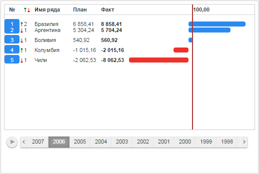

# RatingChartSerie.animateGraph

RatingChartSerie.animateGraph
-

# RatingChartSerie.animateGraph

## Синтаксис

animateGraph(step: Number);

## Параметры

step. Шаг анимации. Может
 принимать значения от «0» до «1».

## Описание

Метод animateGraph отрисовывает
 промежуточный шаг анимации ряда данных.

## Комментарии

Если параметр step принимает
 значение «0», график ряда данных отображается в начале анимации, если
 «1» - в конце.

## Пример

Для выполнения примера предполагается наличие на странице компонента
 [RatingChart](../../Components/RatingChart/RatingChart.htm)
 с наименованием «ratingChart» (см. «[Пример
 создания компонента RatingChart](../../Components/RatingChart/RatingChart_Example.htm)»). Перейдем на второй шаг временной
 шкалы, после чего отобразим шаг анимации изменения позиции и графика первого
 ряда данных:

// Получим временную шкалу
time = ratingChart.getTimeline();
// Укажем второй шаг временной шкалы текущим
time.setCurrentStep(1);
function animate(){
console.log("Дождались завершения анимации смены шага временной шкалы");
// Получим первый ряд данных
serie = ratingChart.getSerie(0);
// Отобразим определенный шаг анимации изменения графика ряда данных
serie.animateGraph(0.8);
// Отобразим определенный шаг анимации изменения позиции ряда данных
serie.animatePosition(0.8);}
// Запустим функцию с задержкой, необходимой для отображения анимации смены шага временной шкалы
setTimeout(animate, 3000)

В результате выполнения примера рейтинговая диаграмма примет следующий
 вид:

См. также:

[RatingChartSerie](RatingChartSerie.htm)

		Справочная
		 система на версию 10.9
		 от 18/08/2025,
		 © ООО «ФОРСАЙТ»,
