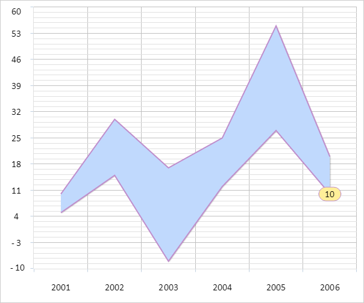

# Пример создания диаграммы с областями

Пример создания диаграммы с областями
-

# Пример создания диаграммы с областями

Для выполнения примера необходимо создать html-страницу и выполнить
 следующие действия:

1. Добавить ссылку на css-файл PP.css. Также нужно добавить ссылки на
 следующие js-файлы:

	- PP.js;

	- PP.GraphicsBase.js;

	- PP.Charts_Canvas.js;

	- resources.ru.js.

2. Далее в теге <head> необходимо добавить стиль для блока с идентификатором
 «chart»:

3. Затем в теге <head> необходимо добавить сценарий, создающий
 диаграмму с областями:

4. В теге <body> в качестве значения атрибута «onLoad» указать
 имя функции для создания диаграммы и добавить блок с идентификатором «chart»:

<body onload="onReady()">
    

</body>
В результате выполнения примера на html-странице была размещена диаграмма
 с областями:

В консоли браузера будут выведены уведомление о том, какая диаграмма
 отображена, и координаты точек, входящие в диапазон от 200 до 300:

Отображена диаграмма с областями и накоплением

Точки, входящие в диапазон от 200 до 300:

(251.35677083333331, 277.2142857142857)

(251.35677083333331, 432.57142857142856)

См. также:

[Chart](Chart.htm)

		Справочная
		 система на версию 10.9
		 от 18/08/2025,
		 © ООО «ФОРСАЙТ»,
