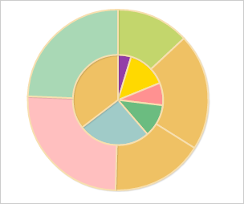

# Пример создания круговой диаграммы

Пример создания круговой диаграммы
-

# Пример создания круговой диаграммы

Для выполнения примера необходимо создать html-страницу и выполнить
 следующие действия:

1. Добавить ссылку на css-файл PP.css. Также нужно добавить ссылки на
 следующие js-файлы:

	- PP.js;

	- PP.GraphicsBase.js;

	- PP.Charts_Canvas.js;

	- resources.ru.js.

2. Далее в теге <head> необходимо добавить стиль для блока с идентификатором
 «chart»:

3. Затем в теге <head> необходимо добавить сценарий, создающий
 круговую диаграмму:

4. В теге <body> в качестве значения атрибута «onLoad» указать
 имя функции для создания диаграммы и добавить блок с идентификатором «chart»:

<body onload="onReady()">
    

</body>
В результате выполнения примера на html-странице была размещена круговая
 диаграмма:

В консоли браузера будет выведена информацию о двух рядах данных круговой
 диаграммы:

Информация о ряде данных «Австралия»:

  Начальный угол первого сектора: 4.71238898038469

  Конечный угол первого сектора: 5.0087656458176895

  Внешний радиус кольца: 56.25

  Внутренний радиус кольца: 0

Информация о ряде данных «Бразилия»:

  Начальный угол первого сектора: 5.531934890016809

  Конечный угол первого сектора: 0.5600230382486151

  Внешний радиус кольца: 112.5

  Внутренний радиус кольца: 56.25

См. также:

[Chart](Chart.htm)

		Справочная
		 система на версию 10.9
		 от 18/08/2025,
		 © ООО «ФОРСАЙТ»,
