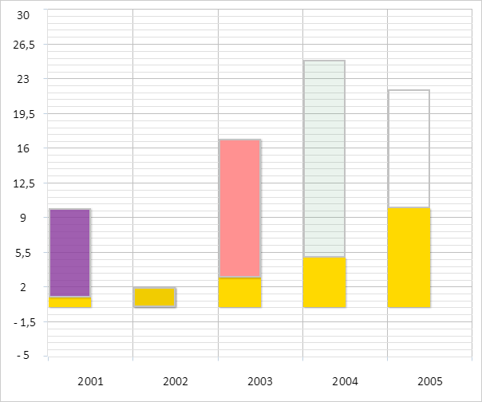
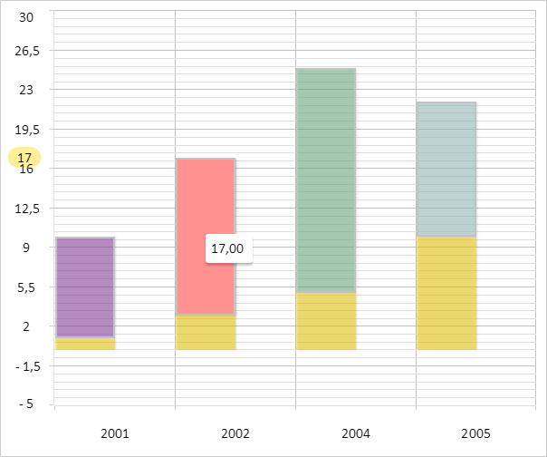
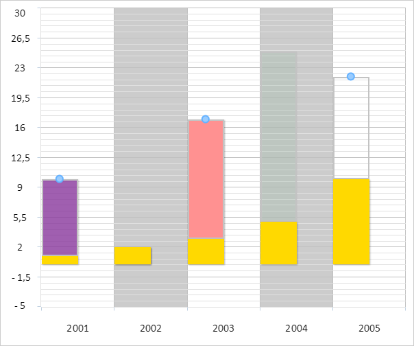
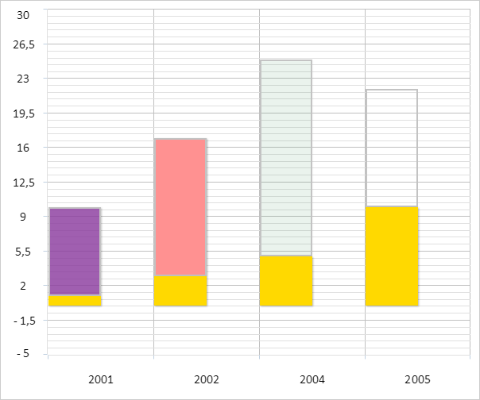

# Пример создания гистограммы с накоплением

Пример создания гистограммы с накоплением
-

# Пример создания гистограммы с накоплением

Для выполнения примера необходимо создать html-страницу и выполнить
 следующие действия:

1. Добавить ссылку на css-файл PP.css. Также нужно добавить ссылки на
 следующие js-файлы:

	- PP.js;

	- PP.GraphicsBase.js

	- PP.Charts_Canvas.js;

	- resources.ru.js.

2. Далее в теге <head> необходимо добавить стиль для блока с идентификатором
 «chart»:

3. Затем в теге <head> необходимо добавить сценарий, создающий
 гистограмму с накоплением:

4. В теге <body> в качестве значения атрибута «onLoad» указать
 имя функции для создания гистограммы с накоплением и добавить блок с идентификатором
 «chart»:

<body onload="onReady()">
    

</body>
В результате выполнения примера на html-странице была размещена гистограмма
 с накоплением:

Вторая точка второй серии диаграммы имеет пустое значение, третья точка
 этой же серии выделена, четвёртая является фиктивной, пятая - невидимой.

При наведении на любую точку второго ряда на оси Y появляется всплывающая
 подсказка, содержащая значение данной точки:

После двойного щелчка на любой точке второго ряда в консоли браузера
 будет выведена информация о данной точке. Например, для третьей точки
 выведенные данные будут следующими:

Выбрана точка ряда данных с индексом «2»

Размеры соответствующего столбца: 52.901119402985074
 x 174

Выбрана точка ряда данных с индексом «3»

Описание точки: Фиктивная точка

Размеры соответствующего столбца: 52.901119402985074
 x 248.57142857142856

Разрешим редактирование точек рядов данных гистограммы:

chart.getEditMode().setEnabled(true);
После выполнения примера был включён режим редактирования точек гистограммы.
 После нажатия на любую точку второго ряда определилось, что для первой,
 третьей и пятой точек данного ряда редактирование разрешено, для остальных
 точек ряда - запрещено:

Удалим столбцы, соответствующие пустым точкам диаграммы:

removeNullPoints();
В результате выполнения данного строки второй столбец диаграммы был
 удалён:

См. также:

[Chart](Chart.htm)

		Справочная
		 система на версию 10.9
		 от 18/08/2025,
		 © ООО «ФОРСАЙТ»,
