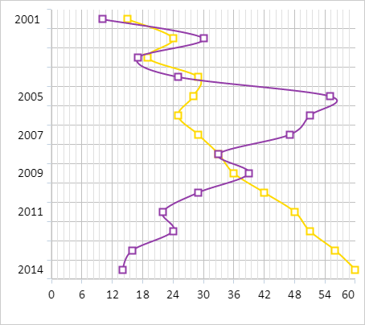

# Пример создания сглаженной диаграммы

Пример создания сглаженной диаграммы
-

# Пример создания сглаженной диаграммы

Для выполнения примера необходимо создать html-страницу и выполнить
 следующие действия:

1. Добавить ссылку на css-файл PP.css. Также нужно добавить ссылки на
 следующие js-файлы:

	- PP.js;

	- PP.GraphicsBase.js;

	- PP.Charts_Canvas.js;

	- resources.ru.js.

2. Далее в теге <head> необходимо добавить стиль для блока с идентификатором
 «chart»:

3. Затем в теге <head> необходимо добавить сценарий, создающий
 инвертированную сглаженную диаграмму с маркерами:

4. В теге <body> в качестве значения атрибута «onLoad» указать
 имя функции для создания диаграммы и добавить блок с идентификатором «chart»:

<body onload="onReady()">
    

</body>
В результате выполнения примера на html-странице была размещена инвертированная
 сглаженная диаграмма с маркерами в виде прямоугольников:

См. также:

[Chart](Chart.htm)

		Справочная
		 система на версию 10.9
		 от 18/08/2025,
		 © ООО «ФОРСАЙТ»,
