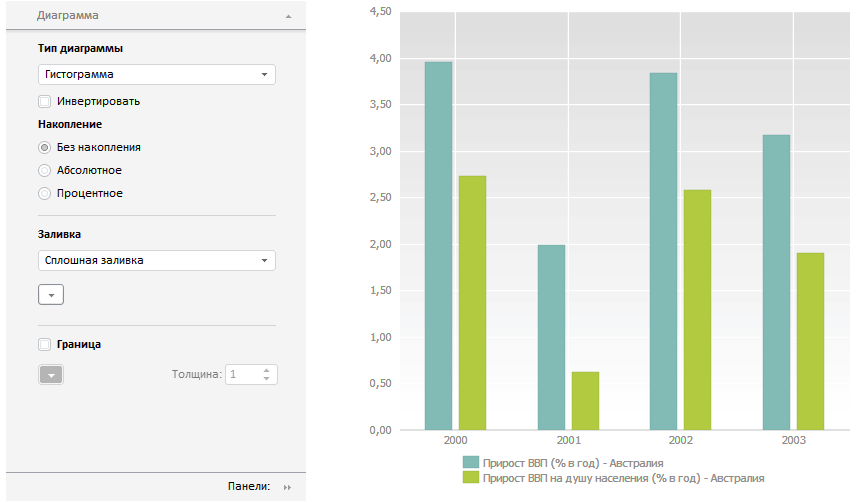

# Пример совместного размещения ChartMaster и ChartBox

Пример совместного размещения ChartMaster и ChartBox
-

# Пример совместного размещения ChartMaster и ChartBox

Для выполнения примера создайте html-страницу и выполните следующие
 действия:

1. В теге HEAD добавьте ссылки на следующие js и css-файлы:

	- PP.css;

	- PP.Express.css;

	- PP.Metabase.css;

	- PP.js;

	- PP.ChartMaster.js;

	- PP.MapMaster.js;

	- PP.MapChart.js;

	- PP.TabSheet.js;

	- PP.Metabase.js;

	- PP.Navigator.js;

	- PP.Express.js;

	- jquery.js;

	- resources.ru.js.

2. В теге SCRIPT добавьте код для создания компонентов [ChartBox](dhtmlExpress.chm::/Classes/Express/ChartBox/ChartBox.htm)
 и [ChartMaster](ChartMaster.htm):

3. В теге BODY разместите созданные компоненты:

<body onselectstart="return false" class="PPNoSelect" onload="onReady()">
    <table style="width: 100%">
        <tr>
            <td valign="top" width="350" id="chartM">
            </td>
            <td valign="top" id="tdChart">
            </td>
        </tr>
    </table>
</body>
После выполнения примера на странице будет размещена [диаграмма
 экспресс-отчёта](dhtmlExpress.chm::/Classes/Express/ChartBox/ChartBox.htm) и [мастер](ChartMaster.htm)
 для её настройки:

См. также:

[ChartMaster](ChartMaster.htm)
 | [ChartBox](dhtmlExpress.chm::/Classes/Express/ChartBox/ChartBox.htm)

		Справочная
		 система на версию 10.9
		 от 18/08/2025,
		 © ООО «ФОРСАЙТ»,
