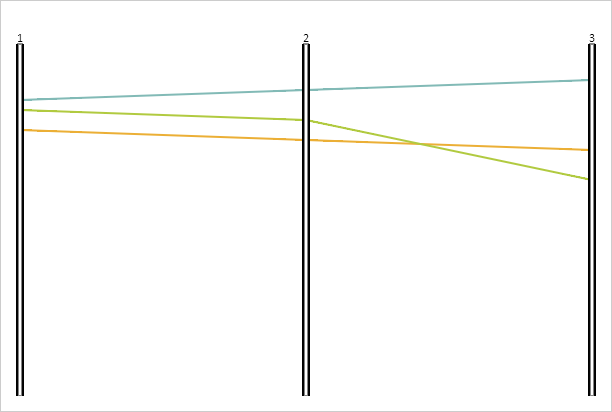

# Пример создания компонента ParallelCoordinates

Пример создания компонента ParallelCoordinates
-

# Пример создания компонента ParallelCoordinates

Для выполнения примера необходимо наличие на html-странице ссылок на
 файлы сценариев PP.js, PP.GraphicsBase.js, PP.ParallelCoordinates.js,
 DataSource.js и файл стилей PP.css, в теге <body> html-страницы
 элемента 
 с идентификатором «area». Файл DataSource.js определяет
 переменную с наименованием «dataSource», содержащую источник данных для
 компонента.

[Содержимое файла
 DataSource.js](javascript:TextPopup(this))

var settings = {
    "Id": "DataSource1", // Идентификатор диаграммы
    "Title": "DataSource with custom attributes", // Заголовок диаграммы
    /* Определяем наименования атрибутов */
    "AttributesNames": {
        "id1": "1",
        "id2": "2",
        "id3": "3"
    },

    /* Определяем наименования рядов данных */
    "ItemsNames": {
        "line1": "Линия 1",
        "line2": "Линия 2",
        "line3": "Линия 3"
    },
    /* Определяем данные рядов */
    "Series": {
        "line1": {

            "id1": {
                "Items": ["80", "90", "100", "110"]
            },
            "id2": {
                "Items": ["70", "80", "90", "100"]
            },
            "id3": {
                "Items": ["60", "70", "80", "90"]
            },
        },
        "line2": {
            "id1": {

                "Items": ["90", "50", "60", "180"]
            },
            "id2": {
                "Items": ["100", "60", "140", "90"]
            },
            "id3": {
                "Items": ["160", "160", "160", "160"]
            },
        },
        "line3": {
            "id1": {
                "Items": ["110", "110", "110", "110"]
            },

            "id2": {
                "Items": ["120", "120", "120", "120"]
            },
            "id3": {
                "Items": ["130", "130", "130", "130"]
            },
        },
    }
};
// Определяем источник данных
var dataSource = new PP.DataSource(settings);

В событии onload тега <body> необходимо указать вызов функции
 createParallel(). Создадим компонент [ParallelCoordinates](ParallelCoordinates.htm):

function createParallel() {
    // Создаем оси диаграммы
    var axes = [];
    for (var i = 1; i <= 3; i++) {
        // Создаем объект для сопоставления данных из источника элементам диаграммы
        var mapping = new PP.DataMapping({
            DataSource: dataSource,
            DimAttributeId: "id" + i,
            Type: "None",
        });
        axes.push(new PP.Ui.PCAxis({

            Mapping: mapping,
            // Устанавливаем ширину диапазона фильтрации
            RangeThickness: 4,
            // Устанавливаем ширина основной линии оси
            BaseThickness: 8,
            // Устанваливаем цвет контура диапазона фильтрации
            RangeStroke: "#0B0B0B",
            // Устанавливаем ширину контура диапазона фильтрации
            RangeStrokeThickness: 1,
        }));

    }
    // Создаем диаграмму
    var coord = new PP.Ui.ParallelCoordinates({
        // Устанавливаем родительский элемент
        ParentNode: document.getElementById("area"),
        // Устанавливаем оси
        Axes: axes,
        // Устанавливаем источник данных
        DataSources: [dataSource],
        // Устанавливаем размер
        Width: 600,
        Height: 400
    });
}
В результате выполнения примера была отображена диаграмма с параллельными
 координатами:

См. также:

[ParallelCoordinates](ParallelCoordinates.htm)

		Справочная
		 система на версию 10.9
		 от 18/08/2025,
		 © ООО «ФОРСАЙТ»,
