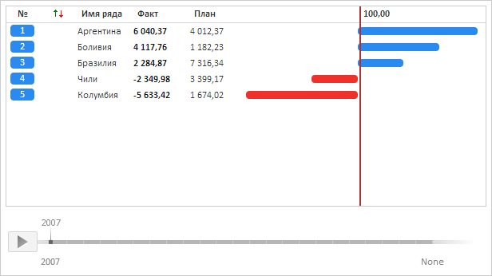

# RatingChart

RatingChart
-

**

# RatingChart

## Описание

Компонент RatingChart представляет
 собой рейтинговую диаграмму.

## Комментарии

Компонент RatingChart реализован классом [RatingChart](../../Classes/RatingChart/RatingChart.htm).

Компонент предназначен для отображения рейтингов [рядов
 данных](../../Classes/RatingChart/RatingChart.DataSource.htm) во времени. Эти ряды можно выделять (в том числе, [сразу
 несколько рядов](../../Classes/RatingChart/RatingChart.AllowMultipleSelection.htm)), сортировать [по
 указанному столбцу значений](../../Classes/RatingChart/RatingChart.ActiveColumn.htm) в [нужном
 режиме](../../Classes/RatingChart/RatingChart.SortMethod.htm), [агрегировать](../../Classes/RatingChart/RatingChart.AggregationAfter.htm).
 Для удобства чтения данных доступно отображение [всплывающих
 подсказок](../../Classes/RatingChart/RatingChart.ShowToolTip.htm) и [разделителя](../../Classes/RatingChart/RatingChart.ShowSplitter.htm).
 Возможно построение [линии
 тренда](../../Classes/RatingChart/RatingChart.TrendLine.htm) с указанными настройками.

Компонент позволяет получить [выделенные
 ряды](../../Classes/RatingChart/RatingChart.getSelection.htm), [ряд
 по указанному индексу](../../Classes/RatingChart/RatingChart.getSerie.htm), а также [массив
 всех рядов](../../Classes/RatingChart/RatingChart.Series.htm) в диаграмме.

Для отображения рядов данных во времени используется [временная
 шкала](../../Classes/RatingChart/RatingChart.Timeline.htm), которая может быть [расположена
 с любой стороны](../../Classes/RatingChart/RatingChart.TimelinePosition.htm) диаграммы.

## Пример

Компонент RatingChart может иметь следующий вид:

[Пример создания компонента RatingChart](RatingChart_Example.htm)

## Конструктор

			 Имя конструктора
			 Краткое описание

			 
			 [RatingChart](dhtmlChart.chm::/Classes/RatingChart/RatingChart_Example.htm)
			 Конструктор RatingChart
			 создает экземпляр компонента RatingChart.

## Свойства

		 Имя свойства
		 Краткое описание

		 
		 [ActiveColumn](dhtmlChart.chm::/Classes/RatingChart/RatingChart.ActiveColumn.htm)
		 Свойство ActiveColumn
		 определяет активный столбец значений рейтинговой диаграммы.

		 
		 [AggregatedSerie](dhtmlChart.chm::/Classes/RatingChart/RatingChart.AggregatedSerie.htm)
		 Свойство AggregatedSerie
		 определяет строку агрегации значений рядов данных.

		 
		 [AggregationAfter](dhtmlChart.chm::/Classes/RatingChart/RatingChart.AggregationAfter.htm)
		 Свойство AggregationAfter**
		 определяет индекс строки, после которой значения рядов данных
		 будут агрегированы.

		 
		 [AllowMultipleSelection](dhtmlChart.chm::/Classes/RatingChart/RatingChart.AllowMultipleSelection.htm)
		 Свойство **AllowMultipleSelection**
		 определяет возможность выделения нескольких рядов данных в рейтинговой
		 диаграмме.

		 
		 [AreDataColumnsResizable](dhtmlChart.chm::/Classes/RatingChart/RatingChart.AreDataColumnsResizable.htm)
		 Свойство AreDataColumnsResizable
		 определяет, будет ли доступно изменение ширины столбцов значений
		 с помощью мыши.

		 
		 [ColumnSpacing](dhtmlChart.chm::/Classes/RatingChart/RatingChart.ColumnSpacing.htm)
		 Свойство ColumnSpacing
		 определяет расстояние между столбцами рейтинговой диаграммы.

		 
		 [DataColumns](dhtmlChart.chm::/Classes/RatingChart/RatingChart.DataColumns.htm)
		 Свойство DataColumns
		 определяет массив столбцов значений рейтинговой диаграммы.

		 
		 [DataSource](dhtmlChart.chm::/Classes/RatingChart/RatingChart.DataSource.htm)
		 Свойство **DataSource**
		 определяет источник данных для рейтинговой диаграммы.

		 
		 [DelayDuration](dhtmlChart.chm::/Classes/RatingChart/RatingChart.DelayDuration.htm)
		 Свойство DelayDuration
		 определяет длительность задержки анимации смены шага временной
		 шкалы.

		 
		 [GraphColumn](dhtmlChart.chm::/Classes/RatingChart/RatingChart.GraphColumn.htm)
		 Свойство GraphColumn
		 определяет столбец с графическим представлением рядов данных.

		 
		 [Header](dhtmlChart.chm::/Classes/RatingChart/RatingChart.Header.htm)
		 Свойство Header определяет
		 строку заголовков рейтинговой диаграммы.

		 
		 [IndexBrush](dhtmlChart.chm::/Classes/RatingChart/RatingChart.IndexBrush.htm)
		 Свойство IndexBrush
		 определяет цвет заливки фона номеров рядов данных.

		 
		 [IndexColumn](dhtmlChart.chm::/Classes/RatingChart/RatingChart.IndexColumn.htm)
		 Свойство IndexColumn
		 определяет столбец с номерами рядов данных.

		 
		 [LineBrush](dhtmlChart.chm::/Classes/RatingChart/RatingChart.LineBrush.htm)
		 Свойство LineBrush
		 определяет цвет заливки рядов данных при положительных значениях.

		 
		 [Max](dhtmlChart.chm::/Classes/RatingChart/RatingChart.Max.htm)
		 Свойство Max возвращает
		 максимальное значение активного столбца значений.

		 
		 [Min](dhtmlChart.chm::/Classes/RatingChart/RatingChart.Min.htm)
		 Свойство Min возвращает
		 минимальное значение активного столбца значений.

		 
		 [MinColumnWidth](dhtmlChart.chm::/Classes/RatingChart/RatingChart.MinColumnWidth.htm)
		 Свойство MinColumnWidth
		 определяет минимальную ширину столбцов рейтинговой диаграммы.

		 
		 [MoveActiveToEnd](dhtmlChart.chm::/Classes/RatingChart/RatingChart.MoveActiveToEnd.htm)
		 Свойство MoveActiveToEnd
		 определяет, будет ли активный столбец значений переноситься в
		 конец.

		 
		 [MoveColumn](dhtmlChart.chm::/Classes/RatingChart/RatingChart.MoveColumn.htm)
		 Свойство MoveColumn
		 определяет столбец изменения позиций рядов данных.

		 
		 [MoveItemsTimeout](dhtmlChart.chm::/Classes/RatingChart/RatingChart.MoveItemsTimeout.htm)
		 Свойство MoveItemsTimeout
		 определяет длительность анимации изменения порядка рядов данных.

		 
		 [NameColumn](dhtmlChart.chm::/Classes/RatingChart/RatingChart.NameColumn.htm)
		 Свойство NameColumn
		 определяет столбец наименований рядов данных.

		 
		 [NegativeLineBrush](dhtmlChart.chm::/Classes/RatingChart/RatingChart.NegativeLineBrush.htm)
		 Свойство NegativeLineBrush
		 определяет цвет заливки рядов данных при отрицательных значениях.

		 
		 [NumberFormat](dhtmlChart.chm::/Classes/RatingChart/RatingChart.NumberFormat.htm)
		 Свойство NumberFormat
		 определяет формат данных рейтинговой диаграммы.

		 
		 [Series](dhtmlChart.chm::/Classes/RatingChart/RatingChart.Series.htm)
		 Свойство **Series**
		 определяет массив рядов данных рейтинговой диаграммы.

		 
		 [ShowSplitter](dhtmlChart.chm::/Classes/RatingChart/RatingChart.ShowSplitter.htm)
		 Свойство **ShowSplitter**
		 определяет признак отображения разделителя в рейтинговой диаграмме.

		 
		 [ShowToolTip](dhtmlChart.chm::/Classes/RatingChart/RatingChart.ShowToolTip.htm)
		 Свойство ShowToolTip
		 определяет признак отображения всплывающей подсказки в рейтинговой
		 диаграмме.

		 
		 [ShowValueTimeout](dhtmlChart.chm::/Classes/RatingChart/RatingChart.ShowValueTimeout.htm)
		 Свойство ShowValueTimeout
		 определяет длительность анимации изменения рейтинговой диаграммы.

		 
		 [SortMethod](dhtmlChart.chm::/Classes/RatingChart/RatingChart.SortMethod.htm)
		 Свойство **SortMethod**
		 определяет режим сортировки элементов в рейтинговой диаграмме.

		 
		 [SplittedTop](dhtmlChart.chm::/Classes/RatingChart/RatingChart.SplittedTop.htm)
		 Свойство SplittedTop
		 определяет количество отображаемых над разделителем рядов данных
		 при первой отрисовке рейтинговой диаграммы.

		 
		 [Timeline](dhtmlChart.chm::/Classes/RatingChart/RatingChart.Timeline.htm)
		 Свойство **Timeline**
		 определяет временную шкалу рейтинговой диаграммы.

		 
		 [TimelinePosition](dhtmlChart.chm::/Classes/RatingChart/RatingChart.TimelinePosition.htm)
		 Свойство **TimelinePosition**
		 определяет расположение временной шкалы в рейтинговой диаграмме.

		 
		 [TrendLine](dhtmlChart.chm::/Classes/RatingChart/RatingChart.TrendLine.htm)
		 Свойство TrendLine
		 определяет линию тренда в рейтинговой диаграмме.

		 
		 [UseAnimation](dhtmlChart.chm::/Classes/RatingChart/RatingChart.UseAnimation.htm)
		 Свойство **UseAnimation**
		 определяет признак воспроизведения анимации в рейтинговой диаграмме.

## Методы

		 Имя метода
		 Краткое описание

		 
		 [beginUpdate](dhtmlChart.chm::/Classes/RatingChart/RatingChart.beginUpdate.htm)
		 Метод beginUpdate отключает
		 перерисовку рейтинговой диаграммы до тех пор, пока не будет вызван
		 метод [endUpdate](dhtmlChart.chm::/Classes/RatingChart/RatingChart.endUpdate.htm).

		 
		 [deselectAll](dhtmlChart.chm::/Classes/RatingChart/RatingChart.deselectAll.htm)
		 Метод deselectAll снимает
		 выделение со всех рядов данных рейтинговой диаграммы.

		 
		 [draw](dhtmlChart.chm::/Classes/RatingChart/RatingChart.draw.htm)
		 Метод draw перерисовывает
		 рейтинговую диаграмму.

		 
		 [drawHeader](dhtmlChart.chm::/Classes/RatingChart/RatingChart.drawHeader.htm)
		 Метод drawHeader перерисовывает
		 строку заголовков рейтинговой диаграммы.

		 
		 [endUpdate](dhtmlChart.chm::/Classes/RatingChart/RatingChart.endUpdate.htm)
		 Метод endUpdate включает
		 перерисовку рейтинговой диаграммы и обновляет её.

		 
		 [getDataColumn](dhtmlChart.chm::/Classes/RatingChart/RatingChart.getDataColumn.htm)
		 Метод getDataColumn
		 возвращает столбец значений рейтинговой диаграммы по его индексу.

		 
		 [getSelection](dhtmlChart.chm::/Classes/RatingChart/RatingChart.getSelection.htm)
		 Метод **getSelection**
		 возвращает массив выделенных рядов данных.

		 
		 [getSerie](dhtmlChart.chm::/Classes/RatingChart/RatingChart.getSerie.htm)
		 Метод getSerie возвращает
		 ряд данных рейтинговой диаграммы по его индексу.

		 
		 [getSerieByVerticalOffset](dhtmlChart.chm::/Classes/RatingChart/RatingChart.getSerieByVerticalOffset.htm)
		 Метод getSerieByVerticalOffset
		 возвращает ряд данных рейтинговой диаграммы по вертикальной координате.

		 
		 [getVisibleSeriesCount](dhtmlChart.chm::/Classes/RatingChart/RatingChart.getVisibleSeriesCount.htm)
		 Метод getVisibleSeriesCount
		 возвращает количество отображаемых рядов данных.

		 
		 [getVisibleSeriesHeight](dhtmlChart.chm::/Classes/RatingChart/RatingChart.getVisibleSeriesHeight.htm)
		 Метод getVisibleSeriesHeight
		 возвращает суммарную высоту отображаемых рядов данных.

		 
		 [isAggregatedSerieVisible](dhtmlChart.chm::/Classes/RatingChart/RatingChart.isAggregatedSerieVisible.htm)
		 Метод isAggregatedSerieVisible
		 возвращает признак видимости строки агрегации рядов данных.

		 
		 [selectAll](dhtmlChart.chm::/Classes/RatingChart/RatingChart.selectAll.htm)
		 Метод selectAll выделяет
		 все ряды данных рейтинговой диаграммы.

		 
		 [showToolTip](dhtmlChart.chm::/Classes/RatingChart/RatingChart.showToolTip_M.htm)
		 Метод showToolTip отображает
		 всплывающую подсказку указанного ряда данных.

		 
		 [update](dhtmlChart.chm::/Classes/RatingChart/RatingChart.update.htm)
		 Метод update обновляет
		 рейтинговую диаграмму.

## События

		 Имя события
		 Краткое описание

		 
		 [DateChanged](dhtmlChart.chm::/Classes/RatingChart/RatingChart.DateChanged.htm)
		 Событие **DateChanged**
		 генерируется после изменения временной линии рейтинговой диаграммы.

		 
		 [PointClick](dhtmlChart.chm::/Classes/RatingChart/RatingChart.PointClick.htm)
		 Событие PointClick
		 генерируется при нажатии на ряд данных в рейтинговой диаграмме.

		 
		 [Selected](dhtmlChart.chm::/Classes/RatingChart/RatingChart.Selected.htm)
		 Событие **Selected**
		 наступает после выделения ряда данных в рейтинговой диаграмме.

		 
		 [SelectionStart](dhtmlChart.chm::/Classes/RatingChart/RatingChart.SelectionStart.htm)
		 Событие **SelectionStart**
		 генерируется при выделении ряда данных в рейтинговой диаграмме.

		 
		 [Sorted](dhtmlChart.chm::/Classes/RatingChart/RatingChart.Sorted.htm)
		 Событие **Sorted**
		 генерируется после завершения сортировки элементов в рейтинговой
		 диаграмме.

		 
		 [Sorting](dhtmlChart.chm::/Classes/RatingChart/RatingChart.Sorting.htm)
		 Событие **Sorting**
		 генерируется в процессе сортировки элементов в рейтинговой диаграмме.

## Свойства, унаследованные от класса [Control](dhtmlUi.chm::/Classes/control/control.htm)

		 Имя свойства
		 Краткое описание

		 
		 [Anchors](dhtmlUi.chm::/Classes/Control/Control.Anchors.htm)
		 Свойство Anchors определяет
		 позицию компонента, размещенного внутри контейнера.

		 
		 [Animation](dhtmlUi.chm::/Classes/Control/Control.Animation.htm)
		 Свойство Animation
		 определяет параметры анимации для компонента.

		 
		 [Bottom](dhtmlUi.chm::/Classes/Control/Control.Bottom.htm)
		 Свойство Bottom определяет
		 отступ снизу при размещении компонента внутри LayoutPanel.

		 
		 [Content](dhtmlUi.chm::/classes\control\control.content.htm)
		 Свойство Content определяет
		 содержимое компонента.

		 
		 [ContextMenu](dhtmlUi.chm::/Classes\Control\Control.ContextMenu.htm)
		 Свойство ContextMenu
		 определяет контекстное меню для компонента.

		 
		 [Data](dhtmlUi.chm::/Classes/Control/Control.Data.htm)
		 Свойство Data предназначено
		 для хранения любых пользовательских данных.

		 
		 [Enabled](dhtmlUi.chm::/classes\control\control.enabled.htm)
		 Свойство Enabled определяет
		 признак доступности компонента для использования.

		 
		 [Height](dhtmlUi.chm::/classes\control\control.height.htm)
		 Свойство Height определяет
		 высоту компонента.

		 
		 [IsRTL](dhtmlUi.chm::/classes\control\control.isrtl.htm)
		 Свойство IsRTL определяет
		 признак расположения элементов компонента по правому краю.

		 
		 [IsVisible](dhtmlUi.chm::/Classes/Control/Control.IsVisible.htm)
		 Свойство IsVisible
		 определяет признак отображения компонента.

		 
		 [Left](dhtmlUi.chm::/Classes/Control/Control.Left.htm)
		 Свойство Left определяет
		 отступ слева при размещении компонента внутри [GridPanel](dhtmlUi.chm::/Components/GridPanel/GridPanel.htm).

		 
		 [Opacity](dhtmlUi.chm::/Classes/Control/Control.Opacity.htm)
		 Свойство Opacity определяет
		 прозрачность компонента.

		 
		 [Parent](dhtmlUi.chm::/Classes/Control/Control.Parent.htm)
		 Свойство Parent определяет
		 родительский компонент элемента управления.

		 
		 [ParentNode](dhtmlUi.chm::/Classes/Control/Control.ParentNode.htm)
		 Свойство ParentNode
		 определяет родительскую DOM-вершину.

		 
		 [ResourceKey](dhtmlUi.chm::/classes\control\control.resourcekey.htm)
		 Свойство ResourceKey
		 определяет ресурсный ключ для компонента.

		 
		 [Right](dhtmlUi.chm::/Classes/Control/Control.Right.htm)
		 Свойство Right определяет
		 отступ справа при размещении компонента внутри LayoutPanel.

		 
		 [Rotate](dhtmlUi.chm::/Classes/Control/Control.Rotate.htm)
		 Свойство Rotate определяет
		 угол поворота компонента.

		 
		 [ShowToolTip](dhtmlUi.chm::/Classes/Control/Control.ShowToolTip.htm)
		 Свойство ShowToolTip
		 определяет признак возможности отображения [всплывающей
		 подсказки](dhtmlUi.chm::/Classes/Control/Control.ToolTip.htm) компонента.

		 
		 [Style](dhtmlUi.chm::/Classes/Control/Control.Style.htm)
		 Свойство Style определяет
		 стиль для компонента.

		 
		 [TabIndex](dhtmlUi.chm::/classes\control\control.tabindex.htm)
		 Свойство TabIndex определяет
		 последовательность перехода элемента управления внутри контейнера.

		 
		 [Tag](dhtmlUi.chm::/Classes/Control/Control.Tag.htm)
		 Свойство Tag определяет
		 JSON-объект, ассоциированный с компонентом.

		 
		 [ToolTip](dhtmlUi.chm::/classes\control\control.tooltip.htm)
		 Свойство ToolTip определяет
		 текст всплывающей подсказки компонента.

		 
		 [Top](dhtmlUi.chm::/Classes/Control/Control.Top.htm)
		 Свойство Top определяет
		 отступ сверху при размещении компонента внутри [GridPanel](dhtmlUi.chm::/Components/GridPanel/GridPanel.htm).

		 
		 [Value](dhtmlUi.chm::/classes\control\control.value.htm)
		 Свойство Value определяет
		 значение компонента.

		 
		 [Width](dhtmlUi.chm::/classes\control\control.width.htm)
		 Свойство Width определяет
		 ширину компонента.

## Методы, унаследованные от класса [Control](dhtmlUi.chm::/Classes/control/control.htm)

		 Имя метода
		 Краткое описание

		 
		 [addClass](dhtmlUi.chm::/classes\control\control.addclass.htm)

		 Метод addClass добавляет
		 CSS-класс к компоненту.

		 
		 [addEventHandler](dhtmlUi.chm::/Classes/Control/Control.addEventHandler.htm)
		 Метод addEventHandler
		 добавляет обработчик события на DOM-вершину.

		 
		 [addStateClass](dhtmlUi.chm::/Classes/Control/Control.addStateClass.htm)

		 Метод addStateClass
		 добавляет CSS-класс к компоненту и удаляет прежний CSS-класс.

		 
		 [addToNode](dhtmlUi.chm::/classes\control\control.addtonode.htm)

		 Метод addToNode добавляет
		 компонент в указанную вершину.

		 
		 [bindEvents](dhtmlUi.chm::/Classes/Control/Control.bindEvents.htm)
		 Метод bindEvents подписывает
		 элемент на все стандартные события.

		 
		 [getAnchorFlags](dhtmlUi.chm::/Classes/Control/Control.getAnchorFlags.htm)

		 Метод getAnchorFlags
		 возвращает JSON-объект с настройками текущей позиции компонента.

		 
		 [getClass](dhtmlUi.chm::/classes\control\control.getclass.htm)

		 Метод getClass возвращает
		 текущие css-классы компонента.

		 
		 [getCssStyle](dhtmlUi.chm::/Classes/Control/Control.getCssStyle.htm)

		 Метод getCssStyle возвращает
		 стили для указанной вершины.

		 
		 [getDomNode](dhtmlUi.chm::/Classes/Control/Control.getDomNode.htm)

		 Метод getDomNode возвращает
		 главную DOM-вершину компонента.

		 
		 [getFocused](dhtmlUi.chm::/Classes/Control/Control.getFocused.htm)

		 Метод getFocused определяет
		 наличие фокуса у компонента.

		 
		 [getIsBinded](dhtmlUi.chm::/Classes/Control/Control.getIsBinded.htm)
		 Метод getIsBinded возвращает
		 признак подписи элемента на события DOM-вершины.

		 
		 [hide](dhtmlUi.chm::/classes\control\control.hide.htm)

		 Метод hide скрывает
		 элемент управления.

		 
		 [hideToolTip](dhtmlUi.chm::/Classes/Control/Control.hideToolTip.htm)

		 Метод hideToolTip очищает
		 таймаут появления подсказки и скрывает её, если она был показана.

		 
		 [refreshStyle](dhtmlUi.chm::/Classes/Control/Control.refreshStyle.htm)
		 Метод refreshStyle
		 обновляет CSS-стили элемента.

		 
		 [removeClass](dhtmlUi.chm::/classes\control\control.removeclass.htm)

		 Метод removeClass удаляет
		 CSS-класс из компонента.

		 
		 [removeEventHandler](dhtmlUi.chm::/Classes/Control/Control.removeEventHandler.htm)
		 Метод removeEventHandler
		 удаляет обработчик события DOM-вершины.

		 
		 [removeFromDOM](dhtmlUi.chm::/classes/control/control.removefromdom.htm)
		 Метод removeFromDOM
		 удаляет вершину из DOM-структуры.

		 
		 [removeStateClasses](dhtmlUi.chm::/Classes/Control/Control.removeStateClasses.htm)

		 Метод removeStateClasses
		 удаляет CSS-классы компонента.

		 
		 [setDraggable](dhtmlUi.chm::/classes\control\control.setdraggable.htm)

		 Метод setDraggable
		 устанавливает возможность перетаскивания компонента на HTML-странице.

		 
		 [setFocus](dhtmlUi.chm::/Classes/Control/Control.setFocus.htm)

		 Метод setFocus устанавливает
		 фокус компонента.

		 
		 [setIsHovered](dhtmlUi.chm::/Classes/Control/Control.setIsHovered.htm)

		 Метод setIsHovered
		 настраивает отображение компонента только при наведении на него
		 курсора.

		 
		 [setSize](dhtmlUi.chm::/classes\control\control.setsize.htm)

		 Метод setSize устанавливает
		 размеры компонента.

		 
		 [show](dhtmlUi.chm::/classes/control/control.show.htm)

		 Метод show отображает
		 элемент управления.

		 
		 [unBindEvents](dhtmlUi.chm::/Classes/Control/Control.unBindEvents.htm)
		 Метод unBindEvents
		 отписывает элемент от всех стандартных событий.

		 
		 [updatePosition](dhtmlUi.chm::/Classes/Control/Control.updatePosition.htm)

		 Метод updatePosition
		 корректирует размер и положение при абсолютном позиционировании
		 на основе текущих параметров.

		 
		 [updateSize](dhtmlUi.chm::/classes\control\control.updatesize.htm)

		 Метод updateSize обновляет
		 размеры компонента подгонке размеров контейнера, в котором находится
		 компонент.

## События, унаследованные от класса [Control](dhtmlUi.chm::/Classes/control/control.htm)

		 Имя события
		 Краткое описание

		 
		 [Drag](dhtmlUi.chm::/classes\control\control.drag.htm)
		 Событие Drag наступает
		 при нажатии и удерживании кнопки мыши.

		 
		 [DragEnd](dhtmlUi.chm::/classes\control\control.dragend.htm)
		 Событие DragEnd наступает
		 при окончании перетаскивания компонента.

		 
		 [DragStart](dhtmlUi.chm::/classes\control\control.dragstart.htm)
		 Событие DragStart наступает,
		 когда начинается перетаскивание компонента.

		 
		 [OnContextMenu](dhtmlUi.chm::/classes\control\control.OnContextMenu.htm)
		 Событие OnContextMenu
		 наступает при вызове контекстного меню компонента.

		 
		 [SizeChanged](dhtmlUi.chm::/Classes/Control/Control.SizeChanged.htm)
		 Событие SizeChanged
		 наступает после изменения размеров компонента.

		 
		 [SizeChanging](dhtmlUi.chm::/Classes/Control/Control.SizeChanging.htm)
		 Событие SizeChanging
		 наступает во время изменения размеров компонента.

## Свойства, унаследованные от класса [Object](dhtmlCommon.chm::/Classes/object/object.htm)

		 Имя свойства
		 Краткое описание

		 
		 [Id](dhtmlCommon.chm::/classes\object\object.id.htm)

		 Свойство Id определяет
		 идентификатор объекта репозитория.

## Методы, унаследованные от класса [Object](dhtmlCommon.chm::/Classes/object/object.htm)

		 Имя метода
		 Краткое описание

		 
		 [clone](dhtmlCommon.chm::/classes\object\object.clone.htm)
		 Метод clone создает
		 копию объекта.

		 
		 [dispose](dhtmlCommon.chm::/classes\object\object.dispose.htm)
		 Метод dispose уничтожает
		 компонент.

		 
		 [getHashCode](dhtmlCommon.chm::/Classes/Object/Object.getHashCode.htm)
		 Метод getHashCode возвращает
		 хеш-код объекта репозитория.

		 
		 [getId](dhtmlCommon.chm::/Classes/Object/Object.Id.htm)
		 Метод getId возвращает
		 идентификатор объекта репозитория.

		 
		 [getSettings](dhtmlCommon.chm::/Classes/Object/Object.getSettings.htm)
		 Метод getSettings возвращает
		 настройки объекта репозитория.

		 
		 [getTypeName](dhtmlCommon.chm::/classes\object\object.gettypename.htm)
		 Метод getTypeName возвращает
		 имя типа объекта без пространства имен, к которому он принадлежит.

		 
		 [isEqual](dhtmlCommon.chm::/Classes/Object/Object.isEqual.htm)
		 Метод isEqual определяет,
		 равен ли заданный объект текущему объекту репозитория.

		 
		 [isLive](dhtmlCommon.chm::/Classes/Object/Object.isLive.htm)
		 Метод isLive определяет
		 действительность объекта репозитория.

		 
		 [removeAllEvents](dhtmlCommon.chm::/Classes/Object/Object.removeAllEvents.htm)
		 Метод removeAllEvents
		 удаляет все обработчики событий объекта по заданному контексту.

		 
		 [setId](dhtmlCommon.chm::/Classes/Object/Object.Id.htm)
		 Метод setId определяет
		 идентификатор объекта репозитория.

		 
		 [setSettings](dhtmlCommon.chm::/Classes/Object/Object.setSettings.htm)
		 Метод setSettings задает
		 настройки объекта репозитория.

		 
		 [defineProps](dhtmlCommon.chm::/Classes/Object/Object.defineProps.htm)
		 Метод defineProps создает
		 методы get и set из массива имен для указанного класса.

		 
		 [keys](dhtmlCommon.chm::/Classes/Object/Object.keys.htm)
		 Метод keys возвращает
		 массив названий методов и свойств для указанного объекта.

См. также:

[DHTML-компоненты](DHTML.chm::/DHTML_components.htm)

		Справочная
		 система на версию 10.9
		 от 18/08/2025,
		 © ООО «ФОРСАЙТ»,
