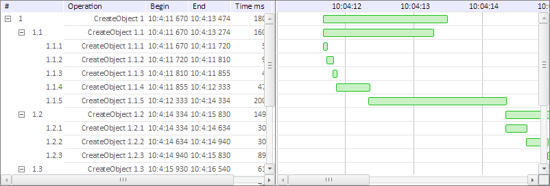

# Пример создания компонента TreeGantDiagram

Пример создания компонента TreeGantDiagram
-

# Пример создания компонента TreeGantDiagram

Для выполнения примера необходимо создать html-страницу и выполнить
 следующие действия:

1. Добавить ссылку на css-файл PP.css.

Также нужно добавить ссылки на следующие js-файлы: PP.js, PP.Other.js
 и resources.ru.js.

2. В теге <body> добавим контейнер для диаграммы и код диаграммы:

В результате выполнения примера на html-странице будет размещен компонент
 [TreeGantDiagram](TreeGantDiagram.htm).

См. также:

[TreeGantDiagram](TreeGantDiagram.htm)

		Справочная
		 система на версию 10.9
		 от 18/08/2025,
		 © ООО «ФОРСАЙТ»,
