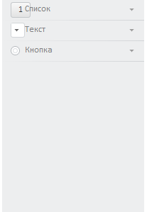

# NavigationItem.HeaderControl

NavigationItem.HeaderControl
-

# NavigationItem.HeaderControl

## Синтаксис

HeaderControl: Object

## Описание

Свойство HeaderControl устанавливает
 элемент управления, который отображается в заголовке [вкладки](NavigationItem.htm).

## Комментарии

По умолчанию в заголовке панели установлен экземпляр компонента CheckBox. Для того чтобы установленный
 элемент управления отображался, для свойства [IsHeaderControlVisible](NavigationItem.IsHeaderControlVisible.htm)
 должно быть установлено значение true.

## Пример

Для выполнения примера подключите ссылки на библиотеку PP.js и таблицы
 визуальных стилей PP.css. Далее приведен javascript-код, при помощи которого
 на html-странице размещается компонент [NavigationBar](../../Components/NavigationBar/NavigationBar.htm),
 состоящий из трех панелей. Установим элемент управления для заголовка
 каждой панели.

var ComboB = new PP.Ui.ComboBox({ //Создаем компонент ComboBox
    ListBox: {
         Items:
        [{
            Content: "1"
        }, {
            Content: "2"
        }]
    },
  Width: 22
});
var Rb = new PP.Ui.RadioButton(); //Создаем компонент RadioButton
var BTN = new PP.Ui.Button({ //Создаем компонент Button
             Content: "1",
             Height: 22
});
var NB = new PP.Ui.NavigationBar({ //Создаем навигатор
    ParentNode: document.getElementById("NB1"),
           Items: //Верхняя панель навигатора
           [{
             Title: "Список"
           }],
           Width: 200,
           IsAlwaysExpanded: false
});
var NI = new PP.Ui.NavigationItem({ //Средняя панель
    Title: "Текст"
});
var NI1 = new PP.Ui.NavigationItem({ //Нижняя панель
    Title: "Кнопка"
});
//Добавляем среднюю и нижнюю панели в навигатор
NB.addItem(NI);
NB.addItem(NI1);
NB.getItem(0).setHeaderControl(BTN); //Устанавливаем элемент управления Button для
//верхней панели
NB.getItem(1).setHeaderControl(ComboB); //Устанавливаем элемент управления ComboBox
//для средней панели
NB.getItem(2).setHeaderControl(Rb); //Устанавливаем элемент управления RadioButton для нижней панели
После выполнения примера в заголовках панелей навигатора стандартные
 элементы управления ([CheckBox](dhtmlUi.chm::/Components/CheckBox/CheckBox.htm))
 ,будут заменены на новые:

См. также:

[NavigationItem](NavigationItem.htm)

		Справочная
		 система на версию 10.9
		 от 18/08/2025,
		 © ООО «ФОРСАЙТ»,
