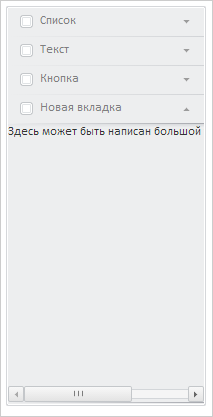
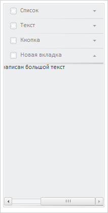

# NavigationItem.showScrolls

NavigationItem.showScrolls
-

# NavigationItem.showScrolls

## Синтаксис

showScrolls();

## Описание

Метод showScrolls отображает
 полосы прокрутки вкладки.

## Пример

Для выполнения примера предполагается наличие на странице компонента
 [NavigationBar](../../Components/NavigationBar/NavigationBar.htm)
 с наименованием «navigationBar» (см. «[Пример
 создания компонента NavigationBar](../../Components/NavigationBar/Example_NavigationBar.htm)»). Добавляем новую вкладку в панель
 свойств:

// Добавляем новую вкладку
var item = new PP.Ui.NavigationItem();
item.setCaption("Новая вкладка");
navigationBar.beginUpdate();
navigationBar.insertItem(item);
navigationBar.endUpdate();
Вставляем в новый элемент подпись с шириной 300 пискелей:

// Вставляем подпись с шириной 300 пискелей в 2 вкладку
item.setContent(new PP.Ui.Label({ Content: "Здесь может быть написан большой текст", Width: 300 }));
Ширина вставленной подписи больше ширины элемента, поэтому в нем появится
 горизонтальная полоса прокрутки:

Прокрутим полосу прокрутки до правого края:

// Прокручиваем полосу прокрутки новой вкладки до правого края
item.getScrollBox().scrollTo(0, 100, true);
В результате элемент будет прокручен вправо:

Скрываем полосы прокрутки у нового элемента:

item.hideScrolls();
В результате полоса прокрутки нового элемента будет скрыта:

Возвращаем полосу прокрутки, меняем ширину подписи во втором элементе
 на 100 пикселей и обновляем полосу прокрутки:

// Раскрываем полосу прокрутки
item.showScrolls();
// Изменяем ширину подписи на второй вкладке
item.getContent().setWidth(100);
// Обновляем полосу прокрутки
item.updateScrolls();
В результате полоса прокрутки будет отсутствовать, так как ширина подписи
 меньше ширины элемента:

См. также:

[NavigationItem](NavigationItem.htm)

		Справочная
		 система на версию 10.9
		 от 18/08/2025,
		 © ООО «ФОРСАЙТ»,
