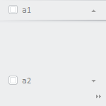

# Конструктор AnimationSettings

Конструктор AnimationSettings
-

# Конструктор AnimationSettings

## Синтаксис

AnimationSettings(useAnimation: Boolean, animationTime: Number);

## Параметры

*useAnimation.* Признак использования анимации в компоненте. Если параметр равен значению true, то анимация будет использована в компоненте, иначе - не будет.

*animationTime.* Длительность анимации в миллисекундах.

## Описание

Метод AnimationSettings создает экземпляр класса [AnimationSettings](AnimationSettings.htm).

## Пример

Для выполнения примера необходимо наличие на html-странице ссылок на файл сценария PP.js и файл стилей PP.css. Создадим навигационную панель с двумя вкладками и настроим для неё параметры анимации:

// Установим длительность анимации, равную 3000 мс
var animation = new PP.AnimationSettings(true, 3000);
// Создадим навигационную панель с двумя вкладками
var bar = new PP.Ui.NavigationBar({
    Items: [new PP.Ui.NavigationItem({
            Title: "a1",
            Height: 100
        }),
        new PP.Ui.NavigationItem({
            Title: "a2"
        })
    ],
    Animation: animation, // Укажем настройки анимации
    Width: 150,
    Height: 150
});
// Добавляем навигационную панель на страницу
bar.addToNode(document.body);

В результате выполнения примера будет создана навигационная панель с двумя вкладками. Длительность анимации при раскрытии вкладок навигационной панели равна 3000 миллисекундам:

См. также:

[AnimationSettings](AnimationSettings.htm)

		Справочная
		 система на версию 10.9
		 от 18/08/2025,
		 © ООО «ФОРСАЙТ»,
