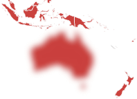

# Конструктор BlurEffect

Конструктор BlurEffect
-

# Конструктор BlurEffect

## Синтаксис

PP.BlurEffect (settings)

## Параметры

settings. JSON-объект
 со значениями свойств экземпляра класса.

## Описание

Конструктор BlurEffect реализует
 экземпляр класса [BlurEffect](BlurEffect.htm).

## Пример

Для выполнения примера предполагается наличие на странице компонента
 [MapChart](dhtmlMapChart.chm::/components/mapchart/mapchart.htm)
 с наименованием «map» (см. «[Размещение
 карты на HTML странице](dhtmlMapChart.chm::/components/mapchart/html_layout.htm)»). Для создания карты используйте топооснову
 World.svg и файл с json-настройками карты MapData_World.xml. Добавим обработчик
 события [MapChart.Loaded](dhtmlMapChart.chm::/Classes/map/mapchart/mapchart.loaded.htm)
 - функцию для применения эффекта рассеивания к отдельной области карты:

	map.Loaded.add(function () {
	    blurEffect = new PP.BlurEffect({ Radius: 5 })
	    blurEffect.apply(map.getShape("AU"),true)
	});

После выполнения примера к области карты с идентификатором «AU» (Австралия)
 будет применен эффект рассеивания:

См. также:

[BlurEffect](BlurEffect.htm)

		Справочная
		 система на версию 10.9
		 от 18/08/2025,
		 © ООО «ФОРСАЙТ»,
